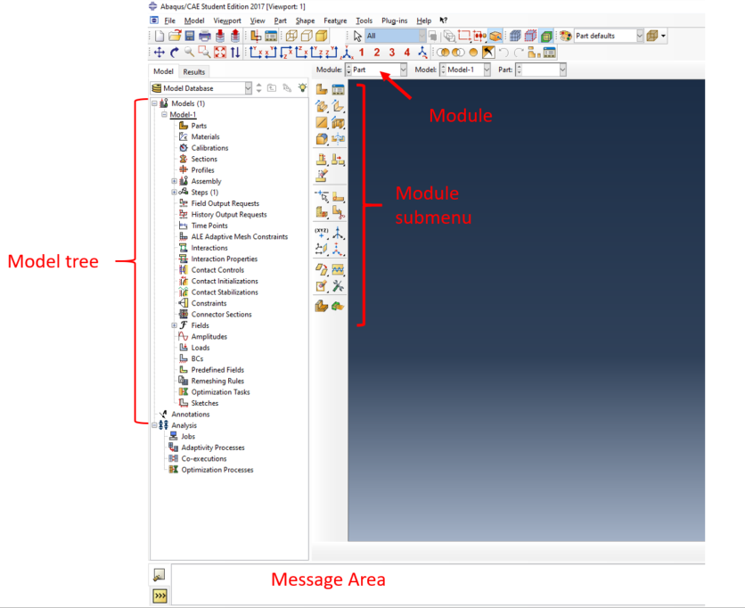
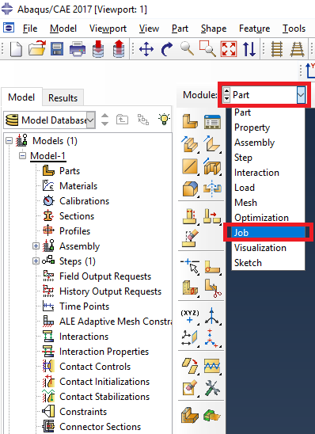
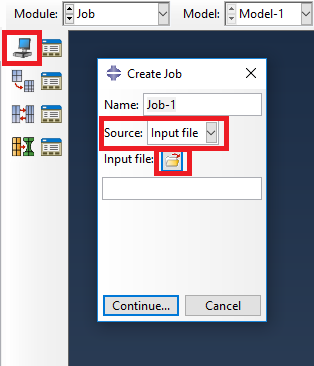
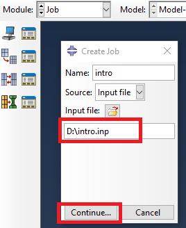
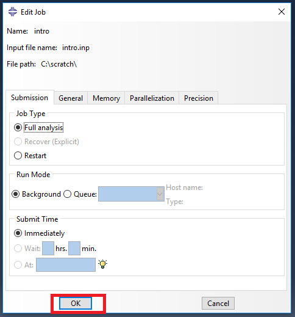
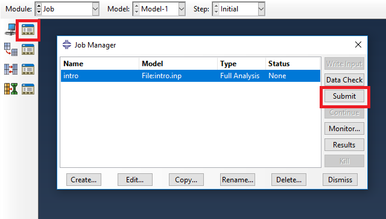
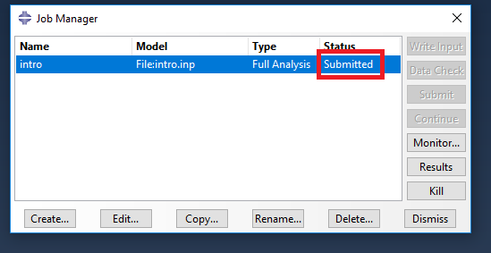
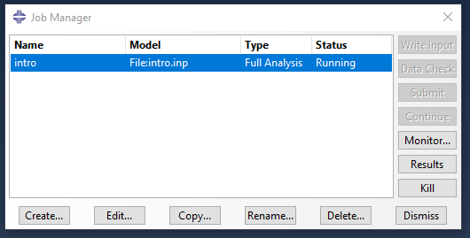

<!--
author: Matthew Blacklock
email: matthew.blacklock@northumbria.ac.uk
version: 1.0.0
language: en
mode: Textbook
import: https://raw.githubusercontent.com/MINT-the-GAP/lia-board-mode/main/README.md
comment: Creating and running a job

script: ../../../course-links.js

@course: <a href="@1" data-lia-course="true">@0</a>
-->

# Creating and running a job

**Tutorial 3 of 4 · First used in Week 1 · Independent study or supported practice**

Create an ABAQUS job from an existing input file, submit it and check that the analysis finishes.

**You need:** ABAQUS/CAE open with a writable work directory, and [intro.inp](../IntroToABAQUS/files/intro.inp) saved in that directory. If needed, complete @[course(the setup tutorial)](../OpeningABAQUS/OpeningABAQUS.md) first.

@[course(ABAQUS tutorial library)](../README.md) · @[course(Week 1 lesson)](../../../week01/week01.md)

The screenshots show the original ABAQUS/CAE interface. Icons and menu wording may vary in the version installed on your PC. Click a screenshot to enlarge it.

## 1. Find the main controls

Locate the **Model Tree**, **Module** dropdown, module toolbox and message area.

When building a model in ABAQUS/CAE, you generally work through the modules from **Part** towards **Job**. In this tutorial, the supplied input file already defines the model.

## 2. Select the Job module

Open the **Module** dropdown, which initially shows **Part**, and select **Job**.

The toolbox changes to show job controls.

## 3. Create a job from an input file

Click the **Create Job** icon at the top of the Job toolbox. In the dialogue, change **Source** to **Input file**.

Click the folder icon to locate your saved `intro.inp` file.

## 4. Select intro.inp

Choose `intro.inp` and confirm the file selection. Use **intro** as the job name for this exercise, then click **Continue…**.

Check that the displayed path points to your copy of the input file. Your path may differ from the screenshot's `D:\intro.inp`.

## 5. Accept the job settings

The **Edit Job** dialogue appears. Leave the settings at their defaults for this introductory example and click **OK**.

## 6. Open Job Manager and submit

Click the **Job Manager** icon. Select your job and click **Submit**.

The job's initial status may be **None** before you submit it.

## 7. Watch the job status

The status changes to **Submitted** when the job is sent for processing.

It changes to **Running** while the solver is working. A small model may pass through these stages too quickly to see each one.

## 8. Confirm completion

When the analysis finishes successfully, the status reads **Completed**. Select the job and click **Results**.

ABAQUS opens the output database in the Visualization module. You will inspect it in the next tutorial.

## If the status is Aborted

**Aborted** means the job did not finish successfully. Open **Monitor** and read the first relevant error message before making a change.

- Check that you selected the intended input file.
- Check the work directory and that you can write files there.
- If you edited the model, compare the edited lines with the original file.
- Save any correction before submitting again.

Debugging is part of modelling. Record the error and ask for help if you cannot explain it. A completed job still needs an engineering check of its results.

## Check your understanding

Which source should you choose to run the downloaded model?

[( )] Model.
[(X)] Input file.

**Before continuing:** your `intro` job shows **Completed**, and you can open its results.

@[course(Next: viewing and interpreting results)](../ViewingInterpretingResults/ViewingInterpretingResults.md)
