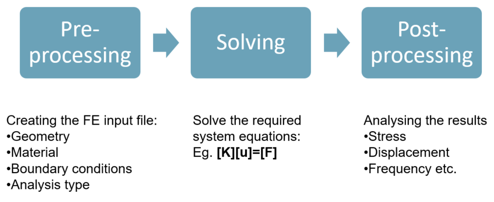
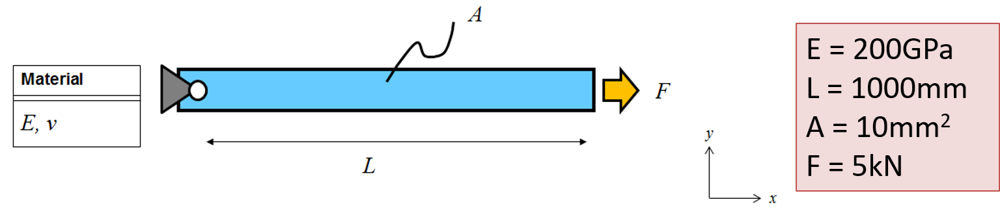
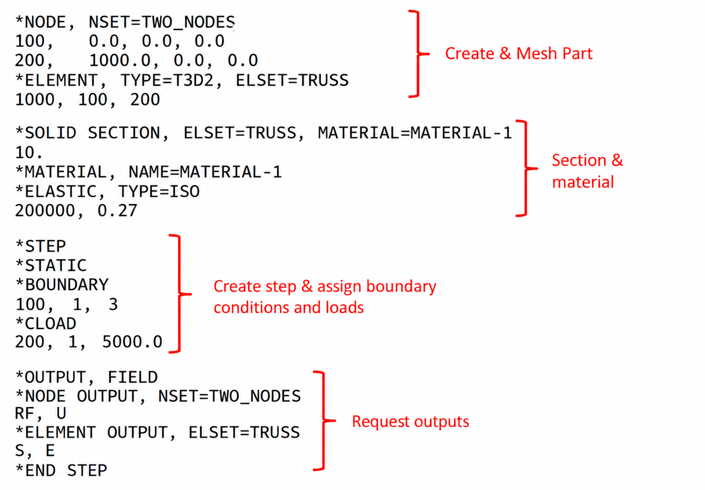
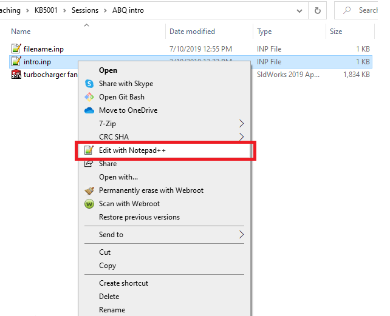

<!--
author: Matthew Blacklock
email: matthew.blacklock@northumbria.ac.uk
version: 1.0.1
language: en
mode: Presentation
icon: ../../../logo.png
import: https://raw.githubusercontent.com/MINT-the-GAP/lia-board-mode/main/README.md
comment: Introduction to ABAQUS finite element analysis software

script: ../../../course-links.js

@course: <a href="@1" data-lia-course="true">@0</a>
-->

# Introduction to ABAQUS Finite Element Analysis Software

**LO**: You will learn how an ABAQUS analysis is organised, recognise the role of an input file and download the example used in the four introductory tutorials.

**You need**: a plain-text editor, such as Notepad. You do not need to have opened ABAQUS yet.

 

@[course(ABAQUS tutorial library)](../README.md) · @[course(Week 1 lesson)](../../../week01/week01.md)

 

## 1. Finite Element Analysis

Solving a problem using FEA requires 3 main steps:

<!-- width="60%" -->

    {{1}}
***********************************
Typically the steps to create an ABAQUS model are as follows:

- Create Part
- Create Material Properties
- Create Section
- Assign Section to Part(s)
- Assemble parts
- Create Step
- Create Interactions (e.g. Multiple Point Constraints)
- Assign Boundary Conditions and Loads
- Mesh Part(s)/Assembly
- Create Job and Run
***********************************

    {{2}}
***********************************
Some of these steps will be familiar from your use of CAD software. Creating and assembling parts can in fact be done through CAD software, such as Solidworks and Catia, and imported into ABAQUS for analysis (feature not available in student edition).

There are three ways to create parts:

1. Draw part(s) in CAD and import into ABAQUS.
2. Draw part(s) directly in ABAQUS.
3. Define parts through an input file.

Defining a part using an input file is the most simple option, but requires knowledge of nodal coordinates and element connectivity (this will be explained later). Drawing the parts within ABAQUS is suitable for simple models, but specialist CAD software is needed for more complex structures.

This module will introduce all three methods, but to start with, we will look at input files.
***********************************

## 2. ABAQUS input files

An input file is a text document with the file extension .inp. These files are version neutral and can be opened and run by ABAQUS. Input files can be edited using any text editing software (e.g. notepad, wordpad, notepad++ etc.)

 

    {{1}}
***********************************
**Example problem**

To demonstrate the use of input files, we will solve the following truss problem:

<!-- width="60%" -->

Here we have a single truss fixed on the left hand side with a force acting along x on the right hand side. Geometric and material properties are defined.

 

***********************************
    {{2}}
***********************************

The input file for this problem is shown below. Constructing input files and usage of various keywords will be covered in future tutorials. For now, consider the highlighted sections:

<!-- width="60%" -->

This input file can be downloaded here: [intro.inp](files/intro.inp) (right click and *Save link as*)

 

***********************************
    {{3}}
***********************************

To edit the input file, I recommend Notepad++. This is a freely available text editor. On campus PCs, Notepad is the best choice. To open the input file, right-click within file explorer and select Edit with Notepad++:

<!-- width="60%" -->

To open with Notepad, right-click and select *Edit in Notepad*. If this option is not available, select *Open with* and choose Notepad.

The file will open. To change any of the model parameters, simply edit then save the file.

 

***********************************
    {{4}}
***********************************

@[course(Next tutorial: opening ABAQUS and setting the work directory)](../OpeningABAQUS/OpeningABAQUS.md)

***********************************