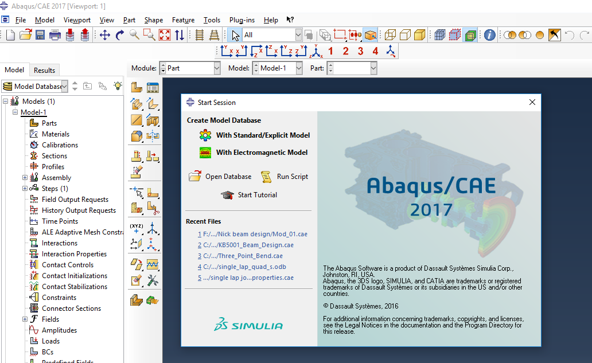
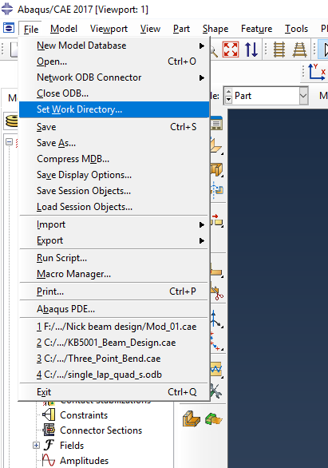
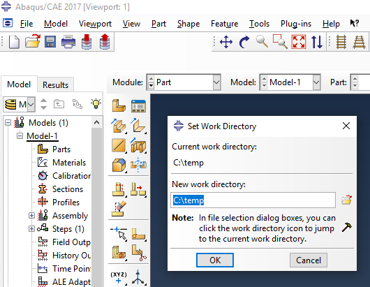
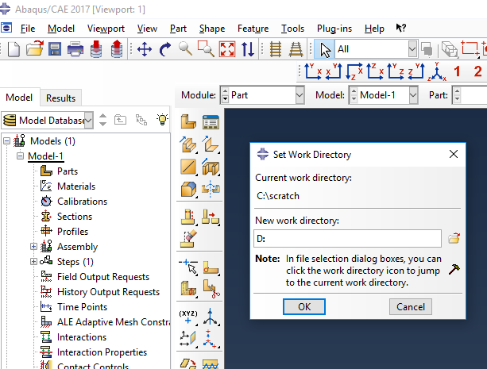

<!--
author: Matthew Blacklock
email: matthew.blacklock@northumbria.ac.uk
version: 1.0.0
language: en
mode: Textbook
import: https://raw.githubusercontent.com/MINT-the-GAP/lia-board-mode/main/README.md
comment: Opening ABAQUS and setting the work directory

script: ../../../course-links.js

@course: <a href="@1" data-lia-course="true">@0</a>
-->

# Opening ABAQUS and setting the work directory

**Tutorial 2 of 4 · First used in Week 1 · Independent study or supported practice**

Open ABAQUS/CAE and select the folder in which your analysis files will be written.

**You need:** access to ABAQUS/CAE and a writable local folder. For the full beginner sequence, complete @[course(the introduction)](../IntroToABAQUS/IntroToABAQUS.md) first.

@[course(ABAQUS tutorial library)](../README.md) · @[course(Week 1 lesson)](../../../week01/week01.md)

The screenshots show the original ABAQUS/CAE interface. Icons and menu wording may vary in the version installed on your PC. Click a screenshot to enlarge it.

## 1. Start ABAQUS/CAE

On Windows, open **Start**, search for **CAE**, and launch the ABAQUS/CAE application available on your machine.

A command window may appear while ABAQUS starts and obtains a licence. Allow it to finish. On campus machines this can take a minute or two.

If the software reports a licence error, record the message and ask for support.

## 2. Start a Standard/Explicit session

On the start-session screen, choose **With Standard/Explicit Model**.

The main ABAQUS/CAE window will open. You can now set the work directory.

## 3. Open Set Work Directory

Choose **File → Set Work Directory…** from the menu bar.

The work directory is where ABAQUS writes the files generated by your jobs. Check it at the start of each campus session.

## 4. Check the default location

The original campus setup shown below defaults to `C:\temp`.

Do not assume this location is writable or suitable on your machine. Choose a local folder you can access, following the current lab instructions.

## 5. Choose a writable local folder

The original tutorial uses `D:\` as a temporary working location. If that drive is available on your lab PC, use the location specified by your lecturer, or create a folder such as `D:\ABAQUS\intro` first.

Type or browse to the chosen folder and click **OK**.

If the PC has no `D:` drive, choose another permitted, writable local folder. The screenshot is an example of the original setup, not a requirement for every machine.

## 6. Put the input file in that folder

Copy your downloaded `intro.inp` into the work directory. If you need another copy, use the [original tutorial input file](../IntroToABAQUS/files/intro.inp).

Before moving on, check that you can find the folder and the `.inp` file in File Explorer.

## Keep the files you need

A temporary local drive belongs to the PC you are using. It may be cleared, and you should not expect to access it from another PC.

After a job finishes, copy the files you need to your usual student storage before logging off. Keep the `.inp` model definition and the `.odb` results if you want to inspect them later. Keep a `.cae` file as well when you build a model in the graphical interface.

## Check your setup

Where should you check first for files generated by a job?

[( )] Whichever folder contains your lecture notes.
[(X)] The work directory selected in ABAQUS.
[( )] The ABAQUS installation folder.

**Before continuing:** ABAQUS/CAE is open, the work directory is set, and `intro.inp` is stored there.

@[course(Next: creating and running a job)](../CreatingRunningJob/CreatingRunningJob.md)
