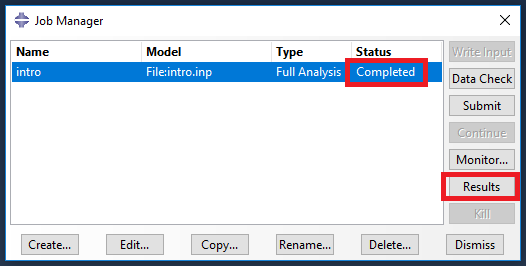
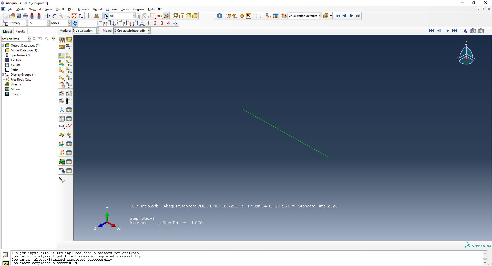
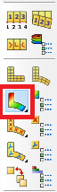
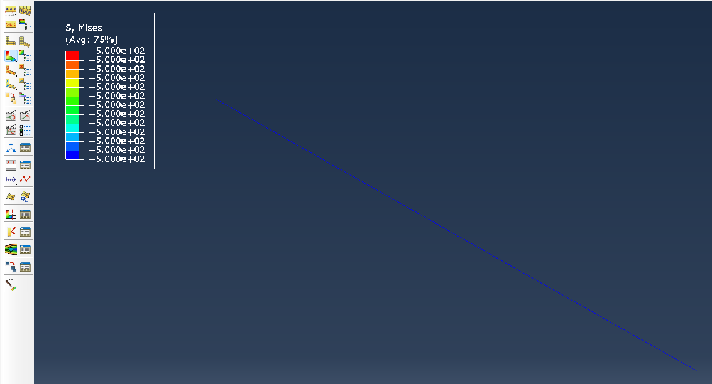
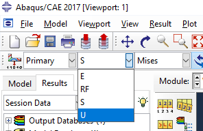
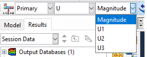
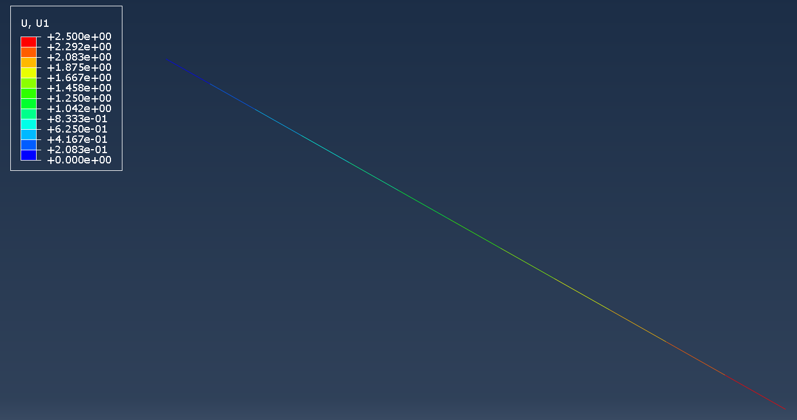
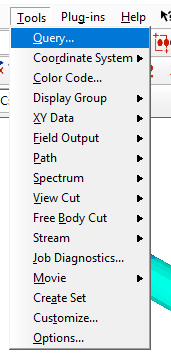
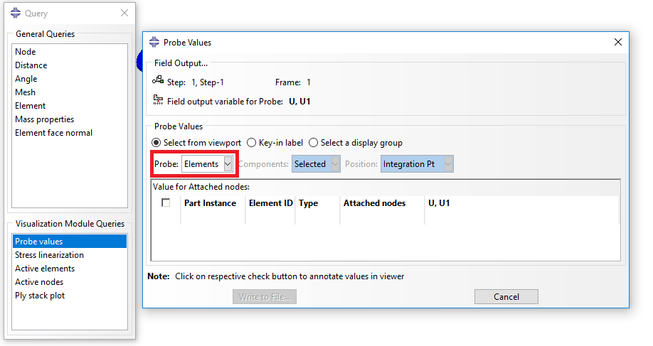
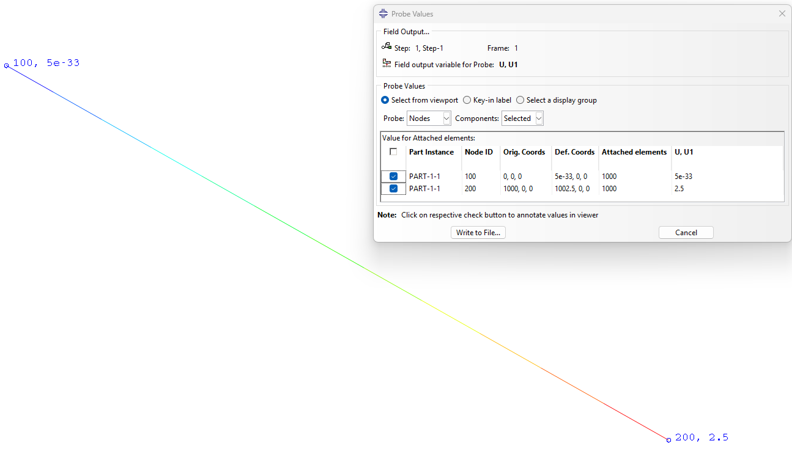

<!--
author: Matthew Blacklock
email: matthew.blacklock@northumbria.ac.uk
version: 1.0.0
language: en
mode: Presentation
icon: ../../../logo.png
import: https://raw.githubusercontent.com/MINT-the-GAP/lia-board-mode/main/README.md
comment: Viewing and interpreting results

script: ../../../course-links.js

@course: <a href="@1" data-lia-course="true">@0</a>
-->

# Viewing and interpreting results

**Tutorial 4 of 4 · First used in Week 1 · Independent study or supported practice**

**LO**: In this tutorial, you will learn how to view ABAQUS results and interpret their meaning in terms of structural analysis.

**You need:** a completed run of [intro.inp](../IntroToABAQUS/files/intro.inp). If needed, complete @[course(creating and running a job)](../CreatingRunningJob/CreatingRunningJob.md) first.

@[course(ABAQUS tutorial library)](../README.md) · @[course(Week 1 lesson)](../../../week01/week01.md)

## 1. Open and plot the results

From the Job module, and only if your job is completed, click Results:

 

    {{1}}
***********************************
The Visualization module will open:

***********************************

 

    {{2}}
***********************************
To view your model results, select the Plot Contours on Deformed Shape icon:

***********************************

 

    {{3}}
***********************************
Your results will display as a contour plot:

The default is the von Mises stress. The above model is a single truss element therefore there is constant stress and there's not much to see.
***********************************

## 2. Change the displayed variable

To change the displayed variable, select S from the dropdown box:

 

    {{1}}
***********************************
For a linear static analysis the options are E (strain), RF (reaction forces), S (stress), U (displacements) and UR (rotations). A truss does not have rotational degrees of freedom so it is not present here. Select U to view the displacement. The dropdown to the right shows suboptions for displacement. They are Magnitude, U1, U2 and U3. These are the vector magnitude and the individual x (U1), y (U2) and z (U3) direction displacements.

***********************************

 

    {{2}}
***********************************
Select U1:

Here we can see the displacement increases from zero at the left hand side to 2.5 at the right hand side.

**Note**: ABAQUS does not have in-built units. It is your responsibility to use consistent units throughout your modelling. Here we are using N, mm, MPa.
***********************************

## 3. Query individual values

To view the result for a specific node, click **Tools** -> **Query** from the top menu:

 

    {{1}}
***********************************
The Query menu will appear. Select **Probe values**:

***********************************

 

    {{2}}
***********************************
When the Probe values window appears you can select whether you want to probe elemental or nodal values. When checking stresses use elements, when checking displacements use nodes. Change the **Probe** to *Nodes* and click on the two nodes at each end of the element. Values will appear in the table:

 

@[course(Return to the ABAQUS tutorial library)](../README.md) · @[course(Return to Week 1 lesson)](../../../week01/week01.md)

***********************************