<!--
author: Matthew Blacklock
email: matthew.blacklock@northumbria.ac.uk
version: 1.0.0
language: en
mode: Presentation
icon: ../../../logo.png
import: https://raw.githubusercontent.com/MINT-the-GAP/lia-board-mode/main/README.md
comment: Topic 1 - introduction to ABAQUS input files.

script: ../../../course-links.js

@course: <a href="@1" data-lia-course="true">@0</a>
-->

# Introduction to ABAQUS input files

**Learning Outcome 1.2.** Model a 1D truss structure using the finite element method and compare your results against hand-calculations.

**You need:** a plain-text editor and the skills from the @[course(four introductory ABAQUS tutorials)](../../General/README.md). Start with a blank Notepad document.

@[course(Topic 1 tutorial library)](../README.md) · @[course(Week 2 lesson)](../../../week02/week02.md)

## 1. Model setup

The problem we would like to model is made up of a single rod fixed at the left-hand side and loaded axially at the right-hand side. The Young’s modulus is E = 210GPa and the Poisson’s ratio is ν = 0.3. The rod has a length of 110mm and a cross-sectional area of 120mm$^2$. The applied load is P = 130N. The aim is to calculate the displacement at the right-hand side.

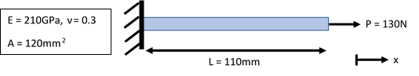

<br>

    {{1}}
***********************************
The first step is to sketch out the finite element equivalent of the problem. This determines the number of nodes and elements we will use and the location and type of boundary conditions and loads.

The rod has constant material properties and cross-sectional area, therefore for axial loading, we only require a single element with a node at each end. In total, we have two nodes each with a single degree of freedom, u.

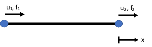
***********************************

<br>

    {{2}}
***********************************
**Boundary Conditions**

The rod is fixed at the left-hand side, therefore we set u$_{1}$ = 0. This forces the displacement of node 1 in the x-direction to be zero.

The displacement at the right-hand side, u$_{2}$, is unknown.

**Loads**

There is an applied load on the right-hand side of 130N, therefore we set f$_{2}$ = 130.

There is no applied load at the left-hand side, f$_{1}$.

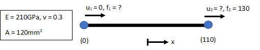
***********************************

## 2. ABAQUS input file

To set up a finite element model in ABAQUS, we need to define the following things:

- Nodes
- Elements
- Section properties including materials
- Analysis type
- Boundary conditions
- Loads, and
- Outputs (stress, displacement etc.)

The input file defines each of these sections using keywords and related required and optional parameters. We will now define each keyword for the above truss problem. Start with a blank notepad document.

## 3. Nodes

To define nodes, ABAQUS uses the `*NODE` keyword. This can then be followed by an optional node set. The following lines (called data lines) are a list of nodes. Here, we will define our two nodes in a node set called “TWO_NODES”.

First we write the `*NODE` keyword followed by our set name (NSET):

```text
*NODE, NSET=TWO_NODES
```

<br>

    {{1}}
***********************************
A node is defined by any unique number and its position in space. Since this is a 1D problem, the location is defined by the x-coordinate. For our first node, we will use a node number of 1. The node is defined using:

```text
1, 0.0
```

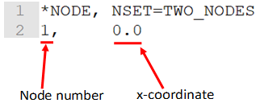

I have written 0.0 for the x-coordinate but you could just write 0.

<br>

**Q. Define the second node in your input file**

<details><summary>Reveal answer</summary>

**A.** `2, 110.0`

</details>

***********************************

## 4. Elements

We have now defined our two nodes and put them in a node set. The input file is as follows:

```text
*NODE, NSET=TWO_NODES
1, 0.0
2, 110.0
```

<br>

    {{1}}
***********************************
The next step is to connect these two nodes together using an element. To define an element in an ABAQUS input file, we use the keyword `*ELEMENT`. This is followed by the element type (TYPE) and an optional element set name (ELSET). The following data lines are a list of elements defined using a unique element number and the nodes connecting that element. For our truss problem we have:

```text
*NODE, NSET=TWO_NODES
1, 0.0
2, 110.0
*ELEMENT, TYPE=T2D2, ELSET=TRUSS
```
***********************************

<br>

    {{2}}
***********************************
ABAQUS has a library of element types that you can use depending on the analysis you want to perform. Here our element type is T2D2. This stands for: **truss, 2D, 2 nodes**.

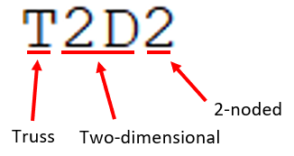
***********************************

<br>

    {{3}}
***********************************
There are many different element types and each has different requirements. We will cover several in this module. We have creatively named the element set (ELSET) “TRUSS”.

Why 2D? Good question. Ideally, for a 1D problem, we would use a 1D truss. However, the lowest ABAQUS lets us go is 2D, so that’s what we use.

Can you use a 3D truss to solve a 1D or 2D problem? Yes, but since there are extra (unnecessary) degrees of freedom, the model can take longer to setup and solve.

<br>

**Q. What is the element type for a three-dimensional, 2-noded truss?**

<!-- data-solution-button="3" -->
**A.** [[T3D2]]<!--
style="display: inline-block; width: 4em;"
-->
***********************************

    {{4}}
***********************************
Next, we define our list of elements. For this problem, we only have one element, so it’s a short list. Large models can contain millions of elements!

To define an element, we use a unique element number (this is only unique for elements, so can be the same as your node numbers) and a list of the nodes that make up the element. For our element, the nodes connecting this element are 1 and 2, so the next line in our input file is:

```text
100,1,2
```

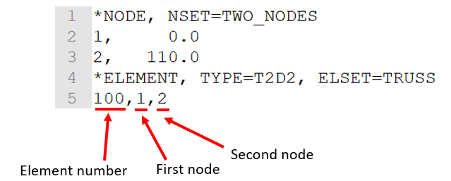

I’ve used 100 for the element number but you don’t have to. You could use 1, 100, 1000, 324 or whatever. I do this so that I don’t get confused between nodes and elements when I refer to them elsewhere in the input file. If we had more than one element, they would be listed underneath the first one in the same way that nodes are.
***********************************

## 5. Section and material

The next thing we must define for our model is the section. This includes a definition of any geometric properties that we haven’t yet defined and the required material properties. The stiffness matrix for a truss element is given as:

$$\mathbf{k}=\frac{EA}{L}\begin{bmatrix}1&-1\\-1&1\end{bmatrix}$$

<br>

    {{1}}
***********************************
So far, we have already defined the length of our truss (ABAQUS gets the length of the element using the coordinate values). We now need to provide values for E (Young’s modulus) and A (cross-sectional area).

The keyword to define a truss section is `*SOLID SECTION`. This is followed by the name of the element set (ELSET) to which you want to apply the section properties, and the material. This looks like this:

```text
*SOLID SECTION, ELSET=TRUSS, MATERIAL=STEEL
```

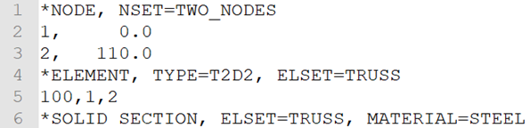
***********************************

<br>

    {{2}}
***********************************
So, we have defined the `*SOLID SECTION` to the element set “TRUSS” that we created earlier, and we are giving it the material properties of “STEEL”. Note: ABAQUS doesn’t have a library of material properties. It does not know what “STEEL” is. We must define these properties in our input file.

First, we need to finish of the section properties. For a truss, that means defining the area. For this problem the area is A = 120mm$^2$, so we simply write (trailing decimal point not necessary):

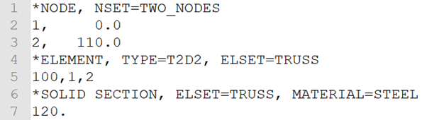

For other element types, there may be other properties required.
***********************************

<br>

    {{3}}
***********************************
**Material**

Next, we must define the material properties for our truss. To do this we use the `*MATERIAL` keyword followed by the name of the material:

```text
*MATERIAL, NAME=STEEL
```
***********************************

<br>

    {{4}}
***********************************
We then need to define the type of material. There are many different types of material properties that can be defined in ABAQUS (elastic, plastic, isotropic, orthotropic, ductile, brittle, thermal conductivity, piezoelectric etc.).

Our material is elastic and isotropic. To define this, we use the `*ELASTIC` keyword followed by the TYPE “ISO”:

```text
*ELASTIC, TYPE=ISO
```
***********************************

<br>

    {{5}}
***********************************
To define an isotropic, elastic material ABAQUS requires the Young’s modulus and Poisson’s ratio:

```text
2.1E5, 0.3
```

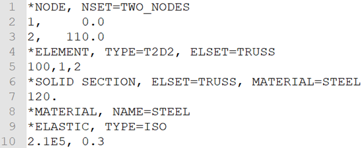

Here, 2.1E5 is the Young’s modulus. E5 is a shorthand way of writing x10⁵ in ABAQUS. This means our value of E is 210,000. But, I hear you scream, our Young’s modulus is 210GPa! Yes, but we have defined our coordinates using millimetres and our force will be entered in Newtons, so we must be consistent. The equivalent units for Young’s modulus are N/mm$^2$ or MPa. 210GPa is the same as 210,000MPa or 2.1E5. We will discuss consistent units in more detail in a later tutorial. The second value, 0.3, is the Poisson’s ratio.

<br>

**Q. If the value of Poisson’s ratio is doubled to ν = 0.6. How will that affect the displacement?**

<!--
data-hint-button="2"
data-solution-button="3"
-->
[( )] Doubled
[( )] Halved
[(X)] No effect
[[?]] Where does ν appear in the stiffness equation?

***********************************

<br>

    {{6}}
***********************************
Why do we need to provide a value for Poisson’s ratio if it has no effect on the results? 

As outlined before, the stiffness matrix for a 1D truss is:

$$\mathbf{k}=\frac{EA}{L}\begin{bmatrix}1&-1\\-1&1\end{bmatrix}$$

Poisson’s ratio, ν, is not in this equation and therefore has no effect, but ABAQUS requires it to define an isotropic material, so we must enter it. ABAQUS accepts any value between 0 < ν < 0.5. For other element types, Poisson’s ratio does feature in the governing equations and will affect the results.

We have now established the basics of our model (nodes, elements, section). The next step is to define the type of analysis we want to perform and any conditions acting upon the model. Following this, we will define the outputs we want the solver to calculate.
***********************************

## 6. Analysis and boundary conditions

**Analysis Type**

The analysis type is defined using the `*STEP` keyword. All other keywords associated with the step are then included, followed by the `*END STEP` keyword. This allows multiple steps with different boundary conditions, loads etc.

Analysis types include static, frequency (vibration), buckling, heat transfer plus many more. We require a `*STATIC` analysis. The input file now reads:

```text
*NODE, NSET=TWO_NODES
1, 0.0
2, 110.0
*ELEMENT, TYPE=T2D2, ELSET=TRUSS
100, 1, 2
*SOLID SECTION, ELSET=TRUSS, MATERIAL=STEEL
120.
*MATERIAL, NAME=STEEL
*ELASTIC, TYPE=ISO
2.1E5, 0.3
**
*STEP
*STATIC
```

The `**` (double asterisk) on line 11 is used to enter comments. This line is not executed by ABAQUS and is useful for breaking your code up into more readable chunks. You cannot have blank lines, so use `**` to create gaps in the file. Here, I have used `**` to separate the initial setup (nodes etc) and step sections.

<br>

    {{1}}
***********************************

**Boundary Conditions**

Next up are the boundary conditions. In our problem, we have u$_{1}$ = 0. This means the displacement in x at node 1 is fixed (zero). In ABAQUS, the x-displacement (u) degree of freedom is denoted using a 1 (v = 2, w = 3 etc.).

To define any boundary conditions, ABAQUS uses the `*BOUNDARY` keyword. This is then followed by a list of nodes and the degree(s) of freedom to fix:

```text
*BOUNDARY
1, 1
```
This fixes node 1 in degree of freedom 1.

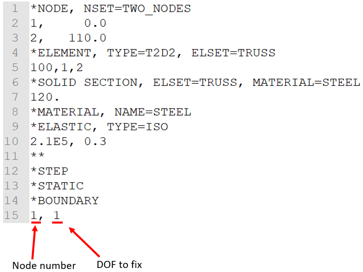
***********************************

<br>

    {{2}}
***********************************
**Q. If we also wanted to fix the x displacement (u) of node 2, what would we write on line 16?** (do not type any spaces)

<!--
data-hint-button="2"
data-solution-button="3"
-->
[[2,1]]
[[?]] You are fixing node 2 in direction 1.


**Q. If this was a 2D truss (x and y) and we wanted to fix the y displacement (v) of node 1, what would we write on line 16?**

<!--
data-hint-button="2"
data-solution-button="3"
-->
[[1,2]]
[[?]] You are fixing node 1 in direction 2.
***********************************

## 7. Loads

** Concentrated Loads**

Now we are going to assign the axial load at the right-hand side of the rod. This is a concentrated load and is applied using the keyword `*CLOAD`. The data lines that follow are a list of loads. 

To define a concentrated load, we must tell ABAQUS where to apply the load (node number), in which direction (degree of freedom) and at what magnitude (in our case 130N):

```text
*CLOAD
2, 1, 130.0
```

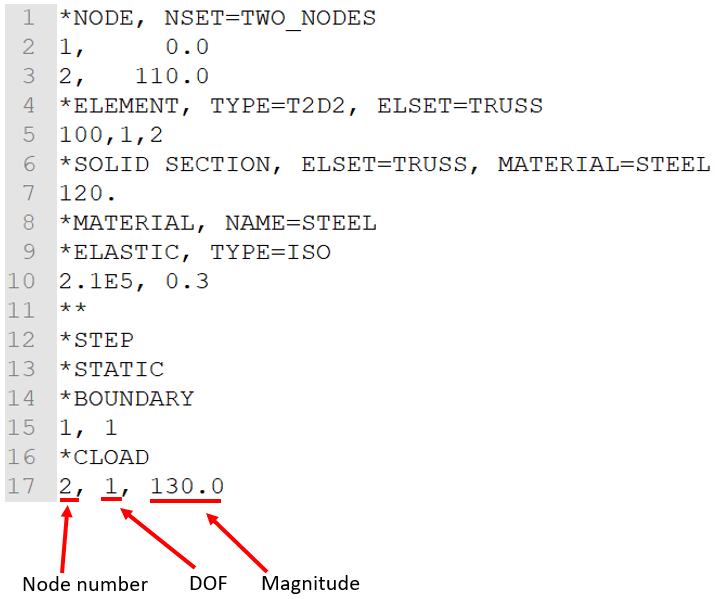

<br>

    {{1}}
***********************************
**Q. If the load was compressive as opposed to tensile, what would line 17 look like?** (no spaces)

<!--
data-hint-button="2"
data-solution-button="3"
-->
[[2,1,-130]]
[[?]] The load is at node 2 in direction 1. Compressive loads have a negative magnitude.
***********************************

## 8. Outputs

The last thing to do is tell ABAQUS what results/outputs we would like calculated. 

Outputs can be calculated for the nodes or elements. Typically, displacements and forces are calculated at the nodes, and stresses and strains across the elements. We’ll ask for both.

First, we need to use the `*OUTPUT` keyword. This is followed by FIELD. To obtain the nodal outputs we use `*NODE OUTPUT` followed by the node set (NSET) we would like the results for. In our case that is “TWO_NODES” that we defined at the start. 

On the data line, we provide a list of the parameters we need. These are the reaction forces (RF) and displacements (U):

```text
*OUTPUT, FIELD
*NODE OUTPUT, NSET=TWO_NODES
RF, U
```

    {{1}}
***********************************
The step to obtain the elemental outputs is very similar. Here, we are asking for the outputs for our “TRUSS” element set, and we want the stress (S) and strain (E):

```text
*ELEMENT OUTPUT, ELSET=TRUSS
S, E
```
***********************************

<br>

    {{2}}
***********************************
We then finish off with the `*END STEP` keyword.

The complete input file is:

```text
*NODE, NSET=TWO_NODES
1, 0.0
2, 110.0
*ELEMENT, TYPE=T2D2, ELSET=TRUSS
100, 1, 2
*SOLID SECTION, ELSET=TRUSS, MATERIAL=STEEL
120.
*MATERIAL, NAME=STEEL
*ELASTIC, TYPE=ISO
2.1E5, 0.3
**
*STEP
*STATIC
*BOUNDARY
1, 1
*CLOAD
2, 1, 130.0
**
*OUTPUT, FIELD
*NODE OUTPUT, NSET=TWO_NODES
RF, U
*ELEMENT OUTPUT, ELSET=TRUSS
S, E
*END STEP
```

We have now setup our model!
***********************************

## 9. Results

Save the file as a .inp and run it in ABAQUS. Check the displacement at the right-hand side.

<br>

    {{1}}
***********************************

**Q. What is the displacement at the right-hand side to 6 d.p,?**

[[0.000567]]

**Q. What are the units of this displacement?**

[[mm]]

**Q. What is the reaction force at the left-hand side (include the units)?**

[[-130N]]

<br>

@[course(Next tutorial: multiple 1D truss elements)](../MultipleTrussElements/MultipleTrussElements.md)
***********************************

