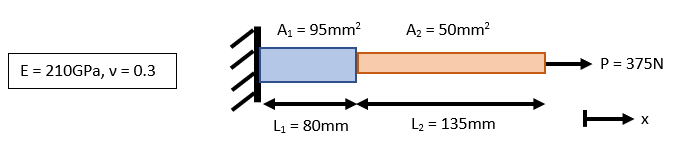
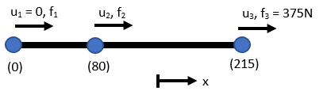
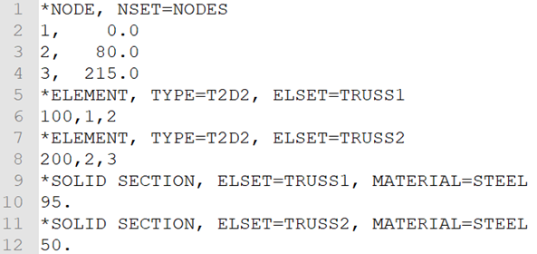

<!--
author: Matthew Blacklock
email: matthew.blacklock@northumbria.ac.uk
version: 1.0.0
language: en
mode: Presentation
icon: ../../../logo.png
import: https://raw.githubusercontent.com/MINT-the-GAP/lia-board-mode/main/README.md
comment: Topic 1 - multiple 1D truss elements with different section properties.

script: ../../../course-links.js

@course: <a href="@1" data-lia-course="true">@0</a>
-->

# Multiple 1D truss elements with different section properties

**Learning Outcome 1.2.** Summarise the keywords used in an ABAQUS input file for a truss structure.

**You need:** the input file created in @[course(the previous Topic 1 tutorial)](../IntroToInputFiles/IntroToInputFiles.md).

<br>

@[course(Topic 1 tutorial library)](../README.md) · @[course(Week 2 lesson)](../../../week02/week02.md)

## 1. Model setup

In the previous example, we set up a single truss element model. This time, we want to set up a model with two different trusses.



<br>

    {{1}}
***********************************
The aim is to calculate the displacement at the right-hand side and where the two rods join at x = 80mm.

As before, the first step is to sketch out the finite element equivalent of the problem:

Since there are two different rods, we require two elements with three nodes.


***********************************

<br>

    {{2}}
***********************************
**Boundary Conditions**

The rod is fixed at the left-hand side, therefore we set u$_{1}$ = 0. This forces the displacement of node 1 in the x-direction to be zero.

The displacements at the right-hand side, u$_{3}$, and join, u$_{2}$, are unknown.

**Loads**

There is an applied load on the right-hand side of 375N, therefore we set f$_{3}$ = 375.

There is no applied load at the left-hand side, f$_{1}$, or joining node, f$_{2}$.
***********************************

## 2. Nodes

Start with the input file from the previous tutorial. It is easier to edit this than start again.

For this problem we have three nodes. The input file should read:

```text
*NODE, NSET=NODES
1, 0.0
2, 80.0
3, 215.0
```

Here we have three nodes at x = 0, x = 80 and x = 215. We get 215 because this is the x-coordinate of the third node (not a length) and is calculated by L$_{1}$ + L$_{2}$.

Also note, I have changed the NSET from “TWO_NODES” to just “NODES”. You don’t have to do this, since it’s just a name, but you’re weird if you don’t.

## 3. Elements

If both trusses were the same material and had the same area, we could simply add an extra element to the list in “ELSET=TRUSS”.

However, the elements have a different area, so we must create an element set for each.

The first is given by:

```text
*ELEMENT, TYPE=T2D2, ELSET=TRUSS1
100,1,2
```

<br>

    {{1}}
***********************************
To define the second element, we simply repeat the two element lines with minor edits:

```text
*ELEMENT, TYPE=T2D2, ELSET=TRUSS2
200,2,3
```
***********************************

## 4. Sections and material

Since we have two element sets with different areas, we need to define two sections.

```text
*SOLID SECTION, ELSET=TRUSS1, MATERIAL=STEEL
95.
*SOLID SECTION, ELSET=TRUSS2, MATERIAL=STEEL
50.
```



<br>

    {{1}}
***********************************
As per the problem, 95 and 50 define the areas of the two trusses in mm$^2$. Note, we refer to the material “STEEL” in both sections. This is because both trusses have the same material properties. Therefore, we only need to define the `*MATERIAL` once:

```text
*MATERIAL, NAME=STEEL
*ELASTIC, TYPE=ISO
210000, 0.3
```
***********************************

## 5. Analysis and boundary conditions

**Analysis Type**

The analysis type is unchanged from our previous example. The input file now reads:

```text
*NODE, NSET=NODES
1, 0.0
2, 80.0
3, 215.0
*ELEMENT, TYPE=T2D2, ELSET=TRUSS1
100,1,2
*ELEMENT, TYPE=T2D2, ELSET=TRUSS2
200,2,3
*SOLID SECTION, ELSET=TRUSS1, MATERIAL=STEEL
95.
*SOLID SECTION, ELSET=TRUSS2, MATERIAL=STEEL
50.
*MATERIAL, NAME=STEEL
*ELASTIC, TYPE=ISO
210000, 0.3
**
*STEP
*STATIC
```

<br>

    {{1}}
***********************************
**Boundary Conditions**

Our boundary conditions are the same as the previous example:

```text
*BOUNDARY
1, 1
```

This fixes node 1 in degree of freedom 1.
***********************************

## 6. Loads

In this problem, the load is applied to the right-hand side, as before. However, our model now has three nodes instead of two.

To apply the 375N load at node 3 in the x-direction, use:

```text
*CLOAD
3, 1, 375.0
```
## 7. Outputs

The required outputs are the same as the first example. We need the reaction forces and displacements at the nodes:

```text
*OUTPUT, FIELD
*NODE OUTPUT, NSET=NODES
RF, U
```

<br>

    {{1}}
***********************************
If you want the output for both truss elements, you will need to use the `*ELEMENT OUTPUT` keyword and S, E data line twice:

```text
*ELEMENT OUTPUT, ELSET=TRUSS1
S, E
*ELEMENT OUTPUT, ELSET=TRUSS2
S, E
```
***********************************

<br>

    {{2}}
***********************************
We then finish off with the `*END STEP` keyword.

The complete input file is:

```text
*NODE, NSET=NODES
1, 0.0
2, 80.0
3, 215.0
*ELEMENT, TYPE=T2D2, ELSET=TRUSS1
100,1,2
*ELEMENT, TYPE=T2D2, ELSET=TRUSS2
200,2,3
*SOLID SECTION, ELSET=TRUSS1, MATERIAL=STEEL
95.
*SOLID SECTION, ELSET=TRUSS2, MATERIAL=STEEL
50.
*MATERIAL, NAME=STEEL
*ELASTIC, TYPE=ISO
210000, 0.3
**
*STEP
*STATIC
*BOUNDARY
1, 1
*CLOAD
3, 1, 375.0
**
*OUTPUT, FIELD
*NODE OUTPUT, NSET=NODES
RF, U
*ELEMENT OUTPUT, ELSET=TRUSS1
S, E
*ELEMENT OUTPUT, ELSET=TRUSS2
S, E
*END STEP
```
***********************************

## 8. Results

Save the file as a .inp and run it in ABAQUS. Check the displacement at the right-hand side and at the join (node 2) using **Tools** -> **Query** -> **Probe Values**.

<br>

    {{1}}
***********************************
**Q. What is the displacement at the right-hand side to 6 d.p. (include the units)?**

[[0.006325mm]]

**Q. What is the displacement at node 2 to 6 d.p. (include the units)?**

[[0.001504mm]]

**Q. What is the reaction force at the left-hand side (include the units)?**

[[-375N]]

<br>

@[course(Return to the Topic 1 tutorial library)](../README.md) · @[course(Return to Week 2)](../../../week02/week02.md)
***********************************
