<!--
author: Matthew Blacklock
email: matthew.blacklock@northumbria.ac.uk
version: 1.0.0
language: en
mode: Presentation
icon: ../../../logo.png
import: https://raw.githubusercontent.com/MINT-the-GAP/lia-board-mode/main/README.md
        ../../../common/templates.md
comment: Topic 1 - two-dimensional truss elements and introduction to ABAQUS CAE.
-->

# Introduction to ABAQUS CAE: 2D truss elements

**Learning Outcome 1.5.** Model a 2D truss structure using the finite element method and compare your results against hand calculations.

**You need:** ABAQUS CAE and the input-file skills from the Week 2 tutorials. Build both an input-file model and a CAE model of the same problem.

@[course(Topic 1 tutorial library)](../README.md) · @[course(Week 3 lesson)](../../../week03/week03.md)


## 1. Model setup

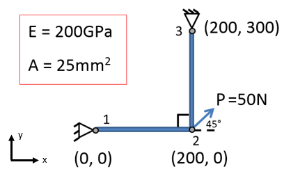

<br>

The problem we are going to model comprises two rods joined at 90°. The first rod (points 1 & 2) is fixed at the left-hand side. The second rod (points 2 & 3) is fixed at the top. There is a load acting at point 2 of 50N at an angle of 45° to the x-axis. The Young’s modulus is E = 200GPa. The rods both have a cross-sectional area of 25mm$^2$. The aim is to calculate the displacement at point 2.

{{1}}
********************
The first step is to sketch out the finite element equivalent of the problem. This determines the number of nodes and elements we will use and the location and type of boundary conditions and loads. 

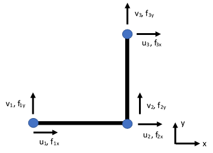

We require two elements and three nodes. Each node has two active degrees of freedom, u and v.

********************

<br>

{{2}}
********************

**Boundary Conditions**

The rod is fixed at nodes 1 and 3, therefore we set u$_1$ = v$_1$ = u$_3$ = v$_3$ = 0. This constrains the displacement of nodes 1 and 3 to be zero in the x- and y-directions.

The displacements at node 2, u$_2$ and v$_2$, are unknown.

**Loads**

There is an applied load acting at 45° to the x-axis of 50N at node 2. To apply this force, we must split it into x and y components. Here, f$_2x$ = 50cos45 = 35.36N and f$_2y$ = 50sin45 = 35.36N.

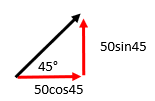


********************

## 2. Input file and corresponding CAE implementation

To set up a finite element model in ABAQUS, we need to define the following things:

- Nodes

- Elements

- Section properties including materials

- Analysis type

- Boundary conditions

- Loads, and

- Outputs (stress, displacement etc.)

Last time, we went through the input file and looked at how keywords are used to define each item in the above list. Here, we will go through the input file and ABAQUS CAE to setup the model using both methods.


## 3. Nodes

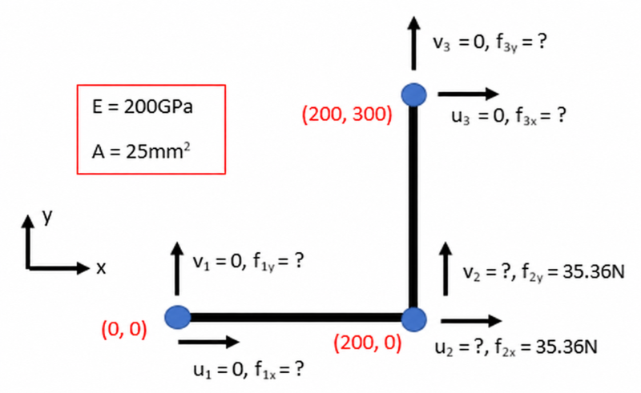

The input file section to define the nodes is as follows for this problem:

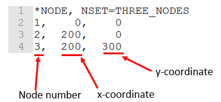

```text
*NODE, NSET=THREE_NODES
1, 0, 0
2, 200, 0
3, 200, 300
```

The only difference from the previous input file for 1D trusses is the provision of the y-coordinate for each node. This is because this is a 2D problem.


## 4. Elements and CAE geometry

Our elements follow the same format as the previous tutorial. The first element is given as:

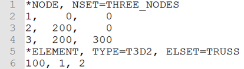

**You may use T2D2 for this planar model.** The original input-file screenshots show T3D2, which is a 3D truss element.

```text
*ELEMENT, TYPE=T2D2, ELSET=TRUSS
100,1,2
```

Since both elements in our problem have the same material properties and cross-sectional area, we can list the second element after the first on line 7.

<br>

**Quick check:** Define the second element on line 7 assuming an element number of 200 (no spaces).

<!-- data-solution-button="3" -->
[[200,2,3]]

<br>

{{1}}
********************

Now we will create the same model in ABAQUS CAE. First, we define the nodes and elements.

Open ABAQUS CAE and create a new Standard/Explicit Model.

Create a new part and select **2D Planar** from *Modelling Space*, then *Wire* from *Base Feature*. This creates a two-dimensional model with a wire part. A wire can be a truss or beam. Press **Continue…**

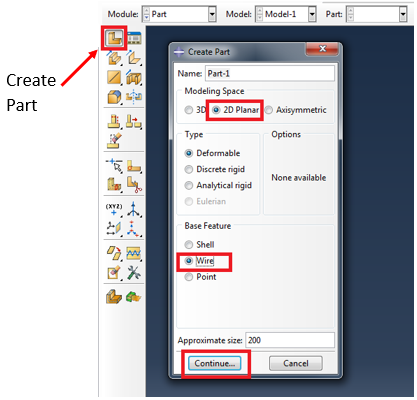

********************

<br>

{{2}}
********************
A sketch grid will be presented. Now, we want to draw the structure. This will be two straight lines.

Click **Create Lines: Connected** from the menu. You can then enter the coordinates of the points (hit enter to create each one) or click on the correct location to place a point.

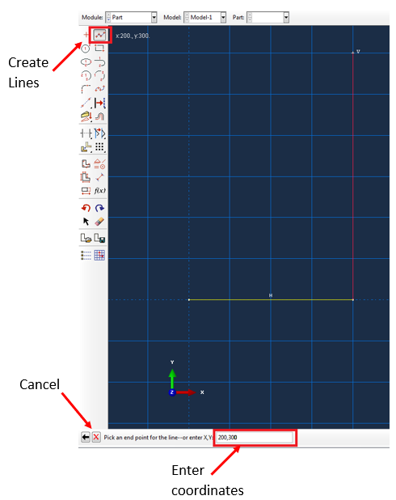

Enter the points **(0, 0)**, **(200, 0)** and **(200, 300)** in that order.

Once you have drawn the two lines, click the red **X** button to stop drawing lines then click **Done**.

Your part should look like this:

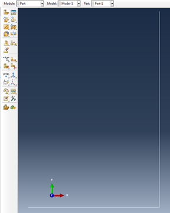

********************


## 5. Mesh and element type in CAE

Select **Mesh** from the dropdown module list and then click **Seed Part**. A menu titled *Global Seeds* will appear:

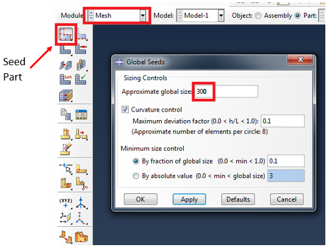

<br>

{{1}}
********************
We only need one element per line, so we should set the *Approximate global size* to 300. This is equal to the longest of the two lines. The *Approximate global size* is the size of each element within the model. If we wanted to split each line into several elements, we could write a smaller number in this box. Try entering a value of 10. Hit **Apply** to see the change in the model. This places nodes every 10mm. 

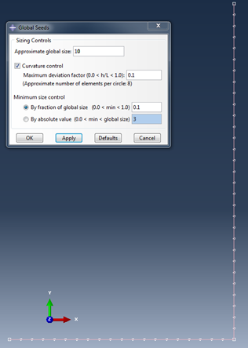

Change the global size back to 300 and press **OK**.

Next, click **Mesh Part** from the menu and click **Yes** at the bottom. The model should turn blue/green and in the message window it will say *“2 elements have been generated on part: Part-1”*.

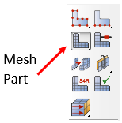


********************

<br>

{{2}}
********************
Next, we want to change the element type. Select **Assign Element Type** and select the entire model. You can do this by dragging a box around the model using the mouse and holding left click or by clicking each line separately whilst holding the shift key. 

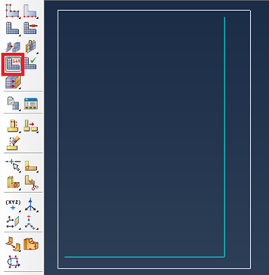

Once both lines are selected, they will turn red. Click **Done** and the following menu appears:

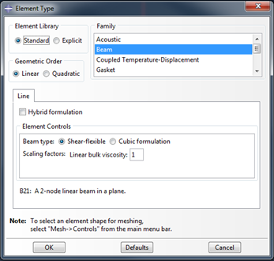

By default, *Beam* is the default element type for a wire model. We want to change this to *Truss* (select Truss in the Family list).

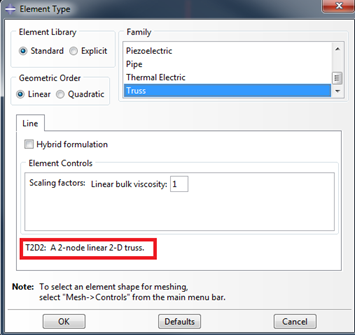

The element type is now set to T2D2. The same as our input file. Press OK.

********************

## 6. Section and material

There are two trusses in our model, but they have the same cross-sectional area and material, so we only need to define one section.

The input file implementation is as the previous tutorial, with an updated area of 25mm$^2$:

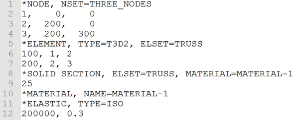

```text
*SOLID SECTION, ELSET=TRUSS, MATERIAL=MATERIAL-1
25
*MATERIAL, NAME=MATERIAL-1
*ELASTIC, TYPE=ISO
200000, 0.3
```

<br>

{{1}}
********************
In ABAQUS CAE select the **Property** module:

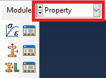

In this module, we can create our material, create a section that includes the cross-sectional area and material, and then assign the section to our part.

First, select **Create Material** from the menu. A window will appear:

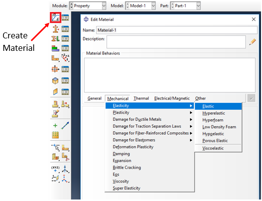


********************

<br>

{{2}}
********************
You can rename the material if you want, then select **Mechanical** from the horizontal menu, followed by **Elasticity** and then **Elastic**. As you can see, there are many different types of material that you can define. In this module, we will always be working with elastic materials.

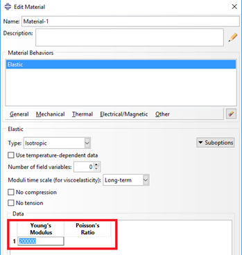

Enter **200000** for the Young’s modulus. (We are working in units of N and mm, so 200GPa = 200,000N/mm$^2$ = 200,000MPa).

<br>

**Quick check:** Does Poisson’s ratio affect the axial stiffness of this linear elastic truss model?

<!-- data-solution-button="3" -->
[(X)] No; it does not affect the axial stiffness.
[( )] Yes; it determines the axial stiffness.
********************
**Correct**. The stiffness of a truss is given by $EA/L$.
********************

********************
{{3}}
********************

Enter a value for Poisson’s ratio (0 < $\nu$ < 0.5) and click **OK**.

Next, we want to create a section. Click **Create Section**, choose Beam from the *Category* list and change the *Type* to **Truss**. Press **Continue…**

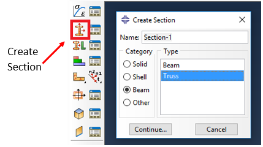


********************

<br>

{{4}}
********************
The Edit Section window will appear. Here we can assign a material to our section (the one we created will be selected by default) and specify the cross-sectional area:

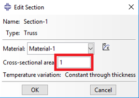

The dialog shows its default area of 1. Replace it with **25 (mm²)** and click **OK**.
********************

<br>

{{5}}
********************

The final step in this module is to assign the section to our part. Click **Assign Section** and select the two lines in our model (drag a box around them or hold shift and click on both), then click **Done** at the bottom of the screen. If you have done this correctly, the lines will turn red and the *Edit Section Assignment* window will open:

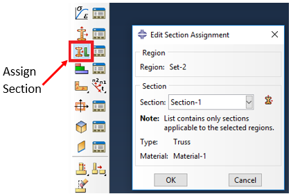

Now we want to select the section from the dropdown menu (again, the section we just created will be selected by default), then click **OK**.


**Quick check:** What colour is the model after assigning the section?

<!-- data-solution-button="3" -->
[(X)] Green
[( )] Blue
[( )] Red

The material and section have now been assigned to our model. If you want to view, edit or delete existing materials, sections or assignments you can use the relevant manager to the right of the create icons:

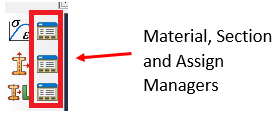


********************

## 7. Assemble parts in CAE

If you have a structure made up of multiple parts, you can assemble them in ABAQUS CAE (we typically don’t do this in an input file). Select the **Assembly** module.

In the Assembly module, you can create instances of different parts and multiple instances of the same part. You can then rotate and translate these parts to assemble your structure.

For our model, we only need a single instance of our part. Click **Instance Part**, the following window appears:

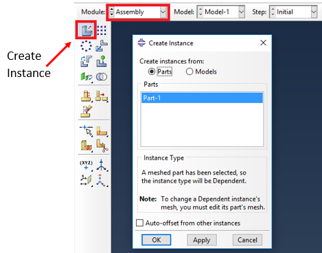


<br>

{{1}}
********************
There will be a list of all the parts you have created (we only have one for this model). You must be careful here not to create additional instances by accident. Clicking *Apply* will create an instance and keep the window open, whereas clicking *OK* will also create an instance and close the window. A common mistake is to click *Apply*, then *OK*. This creates two instances.

Click **OK** to create an instance.

Note: If you do create too many instances by accident, you can delete the ones you don’t need. To do this find the instances in the left-hand menu tree, right click and select delete:

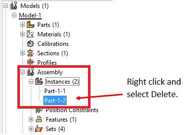


********************

## 8. Analysis type

As with our previous examples, we will be using the `*STEP` and `*STATIC` keywords to define our analysis type:

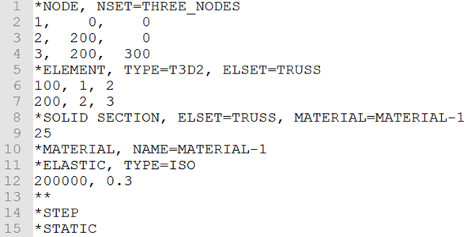

```text
*STEP
*STATIC
```

<br>

{{1}}
********************
To create the step in ABAQUS CAE, go to the **Step** module and select **Create Step**:

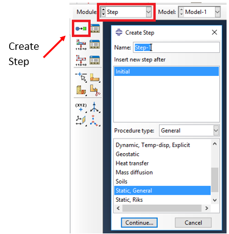

Here, we can select many types of analysis to run (Dynamic, Heat Transfer, Mass diffusion etc.). For this module, we will always select, **Static, General**. Click **Continue…**

A new *Edit Step* window appears. For the time being we’ll use the default values. Click **OK**.


********************

## 9. Boundary conditions

Next up are the boundary conditions. In our problem, we need to set u$_1$ = v$_1$ = u$_3$ = v$_3$ = 0. Remember, in ABAQUS, the x-displacement (u) degree of freedom is denoted using a 1 (v = 2, w = 3 etc.). 

The two boundary conditions at node 1 (u$_1$ = v$_1$ = 0) are defined in the input file as:

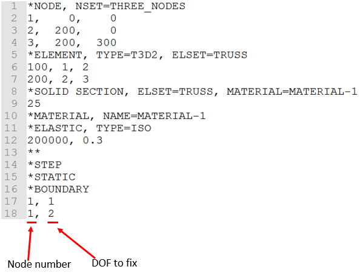

```text
*BOUNDARY
1,1
1,2
```

<br>

{{1}}
********************

**Quick check:** What is the line to fix node 3 in the x-direction (no spaces)?

<!-- data-solution-button="3" -->
[[3,1]]


**Quick check:** What is the line to fix node 3 in the y-direction (no spaces)?

<!-- data-solution-button="3" -->
[[3,2]]

********************

{{2}}
********************

In ABAQUS CAE go to the **Load** module and select **Create Boundary Condition**:

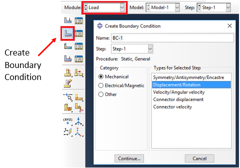

We want to select **Displacement/Rotation** as the boundary condition type. Click **Continue…**

Now, we need to select the points where we want to apply the boundary condition. You can select individual points and apply each condition separately if you want, but since our boundary conditions at nodes 1 and 3 are the same (fixed in x and y), we can apply all boundary conditions in one step. Whilst holding down the shift key, click on the two points. The points (not the lines) should turn red:

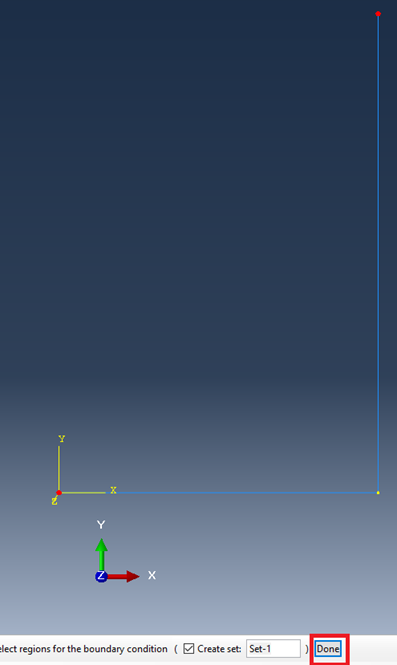

Click **Done**. The *Edit Boundary Condition* box will appear:

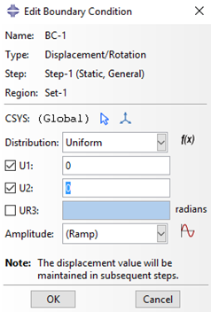

For a 2D problem, three degrees of freedom are listed:

- U1 - Displacement in the x-direction

- U2 - Displacement in the y-direction

- UR3 - Rotation about the z-axis

For a truss element, only U1 and U2 are active (there are no rotation DOFs for trusses). For this boundary condition, we want to set both the displacement in x (U1) and y (U2) to zero. To do this, click the tick box for both degrees of freedom and leave the value at **0** (i.e. zero displacement). Click **OK**.

If done correctly, you should see orange markers at the two nodes, representing the boundary conditions:

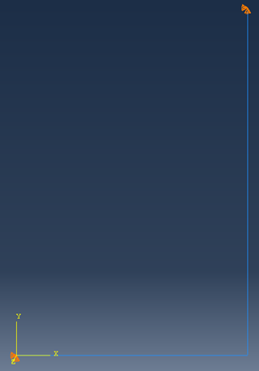

********************

## 10. Loads

Now we are going to assign the x and y components of the 45° applied load (f$_2x$ = 50cos45 = 35.36N and f$_2y$ = 50sin45 = 35.36N). In the input file, this is given as:

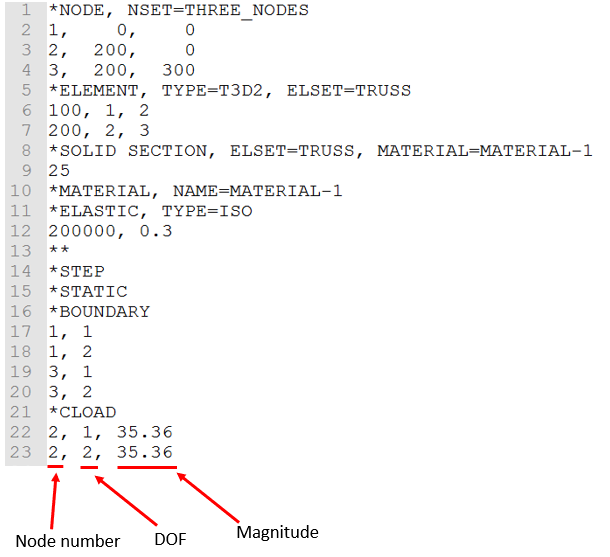

```text
*CLOAD
2,1,35.36
2,2,35.36
```

<br>

{{1}}
********************
In ABAQUS CAE, click **Create Load**:

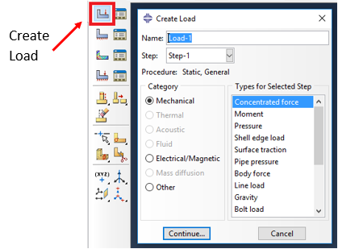

There are many different types of load that can be applied. For this problem, we want a **Concentrated force**. Click **Continue…**

********************

<br>

{{2}}
********************

Next, we need to select the node at which to apply the force. Click on node 2 (it will turn red) and then click **Done**. The *Edit Load* window will appear:

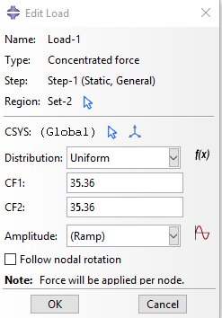

For a 2D model, there are two components:

- CF1 - Concentrated force in the x-direction

- CF2 - Concentrated force in the y-direction

Enter **35.36** in each box and click **OK**. Yellow arrows should appear in the x and y directions:

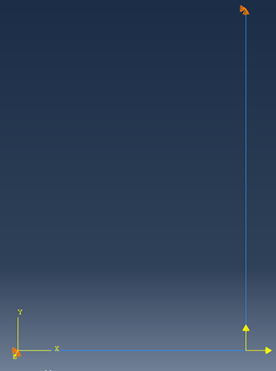


********************

## 11. Outputs, jobs and comparison

The last thing to do is tell ABAQUS what results/outputs we would like calculated. For the input file we follow the same process as the previous examples, your finished input file should look like this:

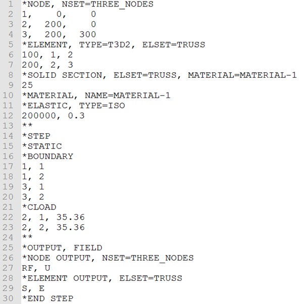

```text
**
*OUTPUT, FIELD
*NODE OUTPUT, NSET=THREE_NODES
RF, U
*ELEMENT OUTPUT, ELSET=TRUSS
S, E
*END STEP
```

<br>

{{1}}
********************
We have now setup our model! Save the file as `2D_Truss_input.inp`. 

In ABAQUS CAE, standard outputs (including RF, U, S and E) are requested automatically, so we don’t have to do anything extra.

You can save your ABAQUS CAE model by choosing **File** -> **Save**. The file type for an ABAQUS model created using CAE is `.cae`. By default this will save in your working directory.

To run the CAE model, go to the **Job** module and select **Create Job**, rename the job to `2D_Truss_CAE`, choose **Model** as the source and click **Continue…**:

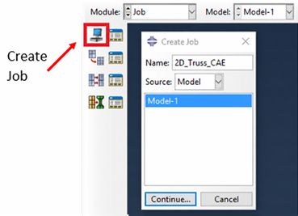


********************

<br>

{{2}}
********************
As always, keep the default options for the *Edit Job* menu and click **OK**.

Create a second new job and this time name it `2D_Truss_input`. Choose **Input file** as the source and select the input file you just created.

Once you have created the second job, go to the *Job Manager*. There should be two jobs listed:

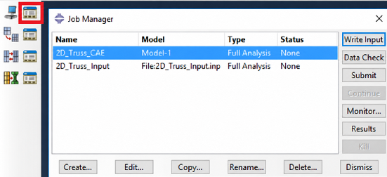


********************

<br>

{{3}}
********************
**Submit** both jobs for analysis and when completed compare the results for both. They should be identical.

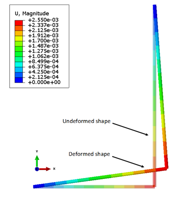

Check the displacement at node 2.


**Quick check:** What is the horizontal (x) displacement at node 2 to 6.d.p, in mm?

<!-- data-solution-button="3" -->
[[0.001414]]


**Quick check:** What is the vertical (y) displacement at node 2 to 6.d.p, in mm?

<!-- data-solution-button="3" -->
[[0.002122]]

Both models should produce the same results.

@[course(Return to Week 3)](../../../week03/week03.md) · @[course(Topic 1 tutorial library)](../README.md)

********************
