<!--
author:   Matthew Blacklock
email:    matthew.blacklock@northumbria.ac.uk
version:  0.5.0
language: en
mode:     Presentation
icon: ../logo.png
import:   https://raw.githubusercontent.com/MINT-the-GAP/lia-board-mode/main/README.md
comment:  KB5034 Week 1 - Module orientation, mechanics recap, and first ABAQUS activity.

script: ../course-links.js

@course: <a href="@1" data-lia-course="true">@0</a>

@style

.lia-slide > .lia-slide__container {
    padding-top: 1.5rem !important;
}

:root {
  --nu-orange: #f28c28;
  --nu-blue: #4f81bd;
  --nu-ink: #171717;
  --nu-pale: #f3f4f6;
}

h2 {
  border-left: 0.35rem solid var(--nu-orange);
  font-family: Arial, Helvetica, sans-serif !important;
  padding-left: 0.7rem;
}

h1 {
  color: var(--nu-ink);
  font-family: Arial, Helvetica, sans-serif !important;
  font-weight: 700 !important;
}

table thead {
  background: var(--nu-pale);
}

input[type="text"] {
  min-width: 6rem;
}

@end
-->

# Week 1: Introduction to mechanics and FEA

<!--
style="width: 34%; min-width: 16rem;"
-->

**KB5034 Mechanics & Finite Element Analysis**<!-- 
style="font-size: 1.5em;" -->

<br>

**Dr Matthew Blacklock & Dr Farnoosh Farhad**

<br>

*School of Engineering, Physics & Mathematics*<!--
style="border-top: 2px solid #f28c28; display: inline-block; padding-top: 0.35rem;"
-->

## Using module content

<br>
**One set of materials for class, practice and review.**

No preparation is required before your first session.

<br>

**In class**

- **A. Introduction:** meet the team and explore the module.
- **B. Review:** 1D stress-strain and run a simple ABAQUS model.

<!-- <br>

**Independent study**

- **C. Prepare:** study axial stress and trusses for Week 2. -->


{{1}}
Use **Presentation** mode to follow the lecturer. Use **Textbook** mode to read the whole lesson afterwards. Questions here are practice checks. Use Blackboard for assessed submissions and deadlines.

## A. IN CLASS: Module Introduction

---

**CLASS STUDY STARTS HERE**

<br>

By the end of Week 1, you should:

- understand the weekly study pattern, 
- be able to use consistent units, 
- calculate an axial bar's response, 
- and run and check an existing ABAQUS input file.

## Meet the module team
<br>

**Dr Matthew Blacklock** — matthew.blacklock@northumbria.ac.uk  

Research: high-temperature ceramic textile composites

<br>

**Dr Farnoosh Farhad** — farnoosh.farhad@northumbria.ac.uk  

Research: fatigue and failure analysis of medical implants

## Mechanics in our research

**Virtual Testing of 3D Woven Textile Composites**

Dr Matthew Blacklock

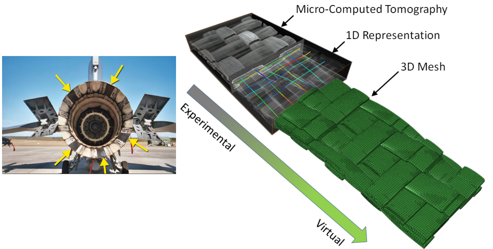<!--
style="display: block; margin-left: auto; margin-right: auto;width: 70%;"
-->

## Mechanics in our research

**Fatigue & Failure Analysis of Medical Implants**

Dr Farnoosh Farhad

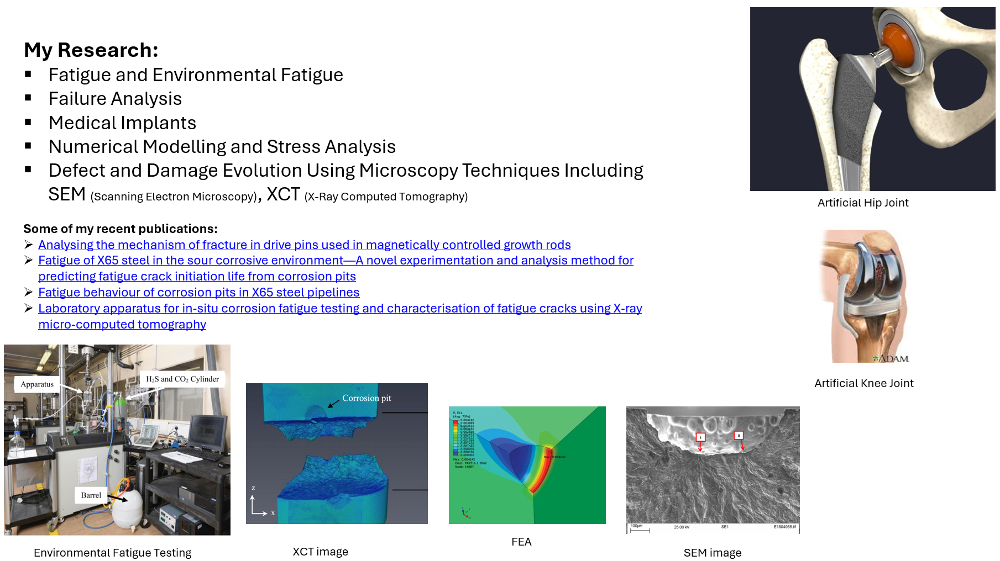<!--
style="display: block; margin-left: auto; margin-right: auto;width: 80%;"
-->

## Approach to Teaching & Learning
<br>

```ascii
                 Life-long Learning

Self-regulated                           Communication
Learning
              .----------------------.
              |   Key Skills for     |
              |    Employability     |
              '----------------------'

Problem Solving                         Critical Thinking
```

## Blended Learning approach to Learning
<br>

<svg viewBox="0 0 900 710" width="60%" style="display:block; margin:auto;" xmlns="http://www.w3.org/2000/svg">

  <defs>
    <marker id="blueArrow"
            markerWidth="10"
            markerHeight="8"
            refX="9"
            refY="4"
            orient="auto"
            markerUnits="strokeWidth">
      <path d="M0,0 L10,4 L0,8 Z" fill="#4A80C3"/>
    </marker>
  </defs>

  <!-- TOP LEFT -->
  <rect x="18" y="118"
        width="350" height="136"
        rx="22" ry="22"
        fill="#E9EFD9"/>

  <text x="193" y="176"
        font-family="Arial, Helvetica, sans-serif"
        font-size="31"
        text-anchor="middle">
    <tspan x="193" dy="0">Online videos &amp;</tspan>
    <tspan x="193" dy="42">tutorials</tspan>
  </text>

  <!-- TOP RIGHT 1 -->
  <rect x="517" y="18"
        width="351" height="137"
        rx="22" ry="22"
        fill="#E9EFD9"/>

  <text x="692" y="76"
        font-family="Arial, Helvetica, sans-serif"
        font-size="31"
        text-anchor="middle">
    <tspan x="692" dy="0">Study fundamental</tspan>
    <tspan x="692" dy="42">theory</tspan>
  </text>

  <!-- TOP RIGHT 2 -->
  <rect x="517" y="175"
        width="351" height="136"
        rx="22" ry="22"
        fill="#E9EFD9"/>

  <text x="692" y="234"
        font-family="Arial, Helvetica, sans-serif"
        font-size="31"
        text-anchor="middle">
    <tspan x="692" dy="0">Learn computer</tspan>
    <tspan x="692" dy="42">software</tspan>
  </text>

  <!-- TOP ARROWS -->
  <line x1="368" y1="186"
        x2="505" y2="88"
        stroke="#4A80C3"
        stroke-width="3"
        marker-end="url(#blueArrow)"/>

  <line x1="368" y1="186"
        x2="505" y2="242"
        stroke="#4A80C3"
        stroke-width="3"
        marker-end="url(#blueArrow)"/>


  <!-- BOTTOM LEFT -->
  <rect x="18" y="504"
        width="350" height="134"
        rx="22" ry="22"
        fill="#E9EFD9"/>

  <text x="193" y="581"
        font-family="Arial, Helvetica, sans-serif"
        font-size="31"
        text-anchor="middle">
    Active lectorials
  </text>

  <!-- BOTTOM RIGHT 1 -->
  <rect x="517" y="409"
        width="351" height="136"
        rx="22" ry="22"
        fill="#E9EFD9"/>

  <text x="692" y="466"
        font-family="Arial, Helvetica, sans-serif"
        font-size="31"
        text-anchor="middle">
    <tspan x="692" dy="0">Further develop</tspan>
    <tspan x="692" dy="42">knowledge</tspan>
  </text>

  <!-- BOTTOM RIGHT 2 -->
  <rect x="517" y="560"
        width="351" height="136"
        rx="22" ry="22"
        fill="#E9EFD9"/>

  <text x="692" y="619"
        font-family="Arial, Helvetica, sans-serif"
        font-size="31"
        text-anchor="middle">
    <tspan x="692" dy="0">Apply knowledge to</tspan>
    <tspan x="692" dy="42">authentic problems</tspan>
  </text>

  <!-- BOTTOM ARROWS -->
  <line x1="368" y1="569"
        x2="505" y2="470"
        stroke="#4A80C3"
        stroke-width="3"
        marker-end="url(#blueArrow)"/>

  <line x1="368" y1="569"
        x2="505" y2="620"
        stroke="#4A80C3"
        stroke-width="3"
        marker-end="url(#blueArrow)"/>

</svg>

## Assessments
<br>

***Formative***

In-class problems – Feedback provided in class

<br>

***Summative***

<u>Assessment *for* learning</u>

001 – Topic-aligned Quizzes, analytical (hand) calculations and computer software (ABAQUS) problems – Instant Feedback (30%) 

<br>

<u>Assessment *of* learning</u>

002 – Timed Online Exam 70% - January assessment period – On campus

## Weekly Timeline
<br>

<svg viewBox="0 0 1060 290" width="90%" xmlns="http://www.w3.org/2000/svg">

  <!-- Arrowhead definition -->
  <defs>
    <marker id="arrowhead"
            markerWidth="10"
            markerHeight="7"
            refX="9"
            refY="3.5"
            orient="auto">
      <polygon points="0 0, 10 3.5, 0 7" fill="black"/>
    </marker>
  </defs>

  <!-- Time arrow -->
  <text x="555" y="28"
        font-size="26"
        text-anchor="middle"
        font-family="Arial, Helvetica, sans-serif">
    Time
  </text>

  <line x1="345" y1="54"
        x2="740" y2="54"
        stroke="black"
        stroke-width="4"
        marker-end="url(#arrowhead)"/>

  <!-- Box 1 -->
  <rect x="10" y="92"
        width="230" height="148"
        fill="#dbe8bd"
        stroke="black"
        stroke-width="1"/>

  <text x="125" y="143"
        font-size="25"
        text-anchor="middle"
        font-family="Arial, Helvetica, sans-serif">
    <tspan x="125" dy="0">Students study</tspan>
    <tspan x="125" dy="30">module material</tspan>
    <tspan x="125" dy="30">BEFORE class</tspan>
  </text>

  <!-- Box 2 -->
  <rect x="286" y="92"
        width="258" height="148"
        rx="24" ry="24"
        fill="#f3dada"
        stroke="black"
        stroke-width="1"/>

  <text x="415" y="128"
        font-size="24"
        text-anchor="middle"
        font-family="Arial, Helvetica, sans-serif">
    <tspan x="415" dy="0">Students complete</tspan>
    <tspan x="415" dy="29">quiz and computer</tspan>
    <tspan x="415" dy="29">software problem</tspan>
    <tspan x="415" dy="29">BEFORE class</tspan>
  </text>

  <!-- Central ellipse -->
  <ellipse cx="685" cy="161"
           rx="107" ry="69"
           fill="#dbe8bd"
           stroke="black"
           stroke-width="1"/>

  <text x="685" y="125"
        font-size="24"
        text-anchor="middle"
        font-family="Arial, Helvetica, sans-serif">
    <tspan x="685" dy="0">In class</tspan>
    <tspan x="685" dy="29">problem</tspan>
    <tspan x="685" dy="29">solving and</tspan>
    <tspan x="685" dy="29">activities</tspan>
  </text>

  <text x="685" y="261"
        font-size="22"
        text-anchor="middle"
        font-family="Arial, Helvetica, sans-serif">
    2.5hr Lectorial
  </text>

  <!-- Box 4 -->
  <rect x="840" y="87"
        width="220" height="143"
        rx="23" ry="23"
        fill="#f3dada"
        stroke="black"
        stroke-width="1"/>

  <text x="950" y="120"
        font-size="23"
        text-anchor="middle"
        font-family="Arial, Helvetica, sans-serif">
    <tspan x="950" dy="0">Students reflect</tspan>
    <tspan x="950" dy="30">on learning</tspan>
    <tspan x="950" dy="30">outcomes for</tspan>
    <tspan x="950" dy="30">each topic</tspan>
  </text>

</svg>

{{1}}
<svg viewBox="0 0 1080 260"
     width="85%"
     style="display:block; margin:auto;"
     xmlns="http://www.w3.org/2000/svg">

  <!-- Thursday background band -->
  <rect x="18" y="133"
        width="998" height="120"
        fill="#dfeaf7"/>

  <!-- Day labels -->
  <text x="28" y="80"
        font-family="Arial, Helvetica, sans-serif"
        font-size="23"
        font-weight="700">
    Wednesday
  </text>

  <text x="28" y="201"
        font-family="Arial, Helvetica, sans-serif"
        font-size="23"
        font-weight="700">
    Thursday
  </text>

  <!-- Lectorial Group 2 -->
  <rect x="165" y="144"
        width="292" height="103"
        rx="18" ry="18"
        fill="white"
        stroke="#4a86c5"
        stroke-width="3"/>

  <text x="311" y="188"
        text-anchor="middle"
        font-family="Arial, Helvetica, sans-serif"
        font-size="22">
    <tspan x="311" dy="0">Lectorial Group 2</tspan>
    <tspan x="311" dy="29">9.30am – 12pm, TRY 001</tspan>
  </text>

  <!-- Lectorial Group 1 -->
  <rect x="471" y="144"
        width="292" height="103"
        rx="18" ry="18"
        fill="white"
        stroke="#4a86c5"
        stroke-width="3"/>

  <text x="617" y="188"
        text-anchor="middle"
        font-family="Arial, Helvetica, sans-serif"
        font-size="22">
    <tspan x="617" dy="0">Lectorial Group 1</tspan>
    <tspan x="617" dy="29">1 – 3.30pm, TRY 001</tspan>
  </text>

  <!-- Wednesday quiz submission -->
  <rect x="778" y="23"
        width="213" height="103"
        rx="18" ry="18"
        fill="white"
        stroke="red"
        stroke-width="3"/>

  <text x="884" y="68"
        text-anchor="middle"
        font-family="Arial, Helvetica, sans-serif"
        font-size="22">
    <tspan x="884" dy="0">Quiz Submission</tspan>
    <tspan x="884" dy="29">11.59pm</tspan>
  </text>

  <!-- Thursday ABAQUS submission -->
  <rect x="778" y="144"
        width="213" height="103"
        rx="18" ry="18"
        fill="white"
        stroke="red"
        stroke-width="3"/>

  <text x="884" y="174"
        text-anchor="middle"
        font-family="Arial, Helvetica, sans-serif"
        font-size="22">
    <tspan x="884" dy="0">ABAQUS</tspan>
    <tspan x="884" dy="29">Submission</tspan>
    <tspan x="884" dy="29">11.59pm</tspan>
  </text>

</svg>

## Should I do the online work?
<br>
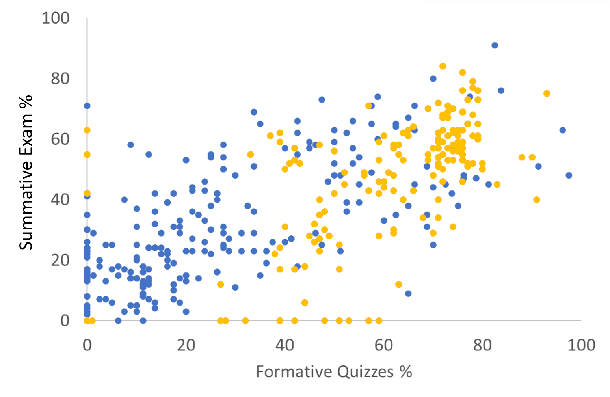<!--
style="display: block; margin-left: auto; margin-right: auto;"
-->

{{1}}

<svg viewBox="0 0 1468 915"
     width="100%"
     style="display:block; margin:-62.3% auto 0 auto; position:relative; pointer-events:none;"
     xmlns="http://www.w3.org/2000/svg">

  <!-- Lower-left ellipse -->
  <ellipse cx="500" cy="585"
           rx="200" ry="200"
           fill="#f8d9d3"
           fill-opacity="0.55"
           stroke="red"
           stroke-width="4"/>

  <!-- Upper-right ellipse -->
  <ellipse cx="950" cy="450"
           rx="300" ry="195"
           fill="#e4f1cf"
           fill-opacity="0.65"
           stroke="#738f35"
           stroke-width="4"/>

</svg>

## Module Learning Outcomes
<br>

MLO1.  Relate knowledge of mathematics, statistics, natural science and engineering principles to broadly defined mechanics problems. 
<br><br>

MLO2.  Select and apply appropriate computational and analytical techniques, such as finite element analysis, to model broadly defined problems.​
<br><br>

MLO3.  Apply creativity and curiosity to analyse broadly defined problems, related to the mechanics of materials, reaching substantiated conclusions.​

## Applying mechanics theory to practical engineering problems

<br>

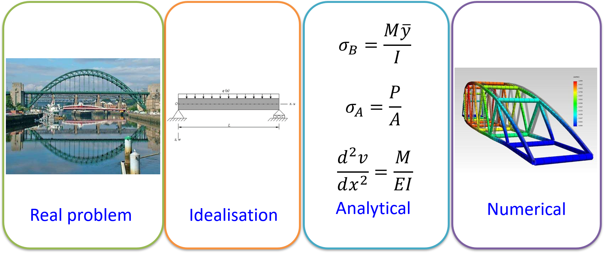<!--
style="display:block; width:80%; margin:auto;"
-->

## Quick check: the stress–strain curve

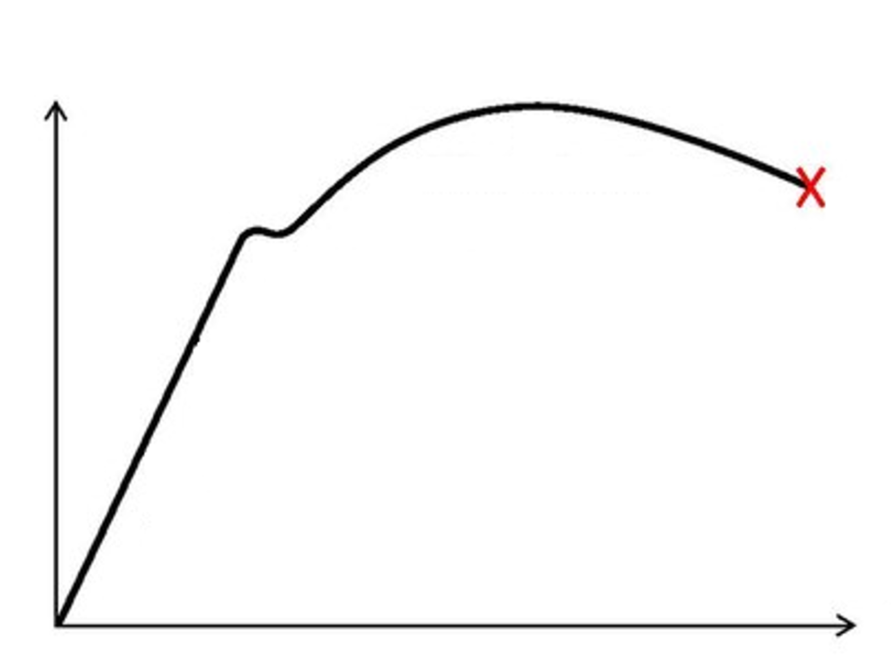<!--
style="display:block; width:50%; margin:auto;"
-->

Sketch the stress-strain curve above and label as many features as you can.

{{1}}
****************************
Linking the stress-strain curve to the physical experiment.

<!-- data-sortable="false" -->
|  |  |  |  |
|:---:|:---:|:---:|:---:|
| 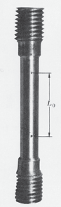 | 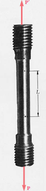 | 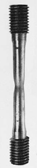 | 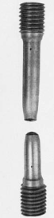 |
| **Initial specimen** | **Under axial load** | **Necking** | **Fracture** |
****************************

## Finite Element Analysis

<br>

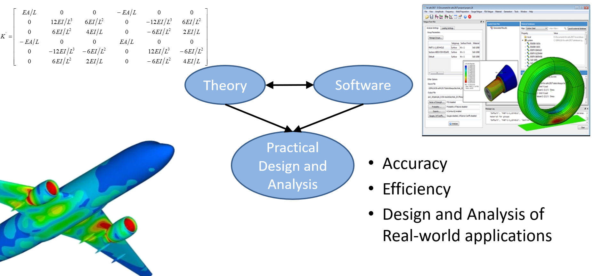<!--
style="display:block; width:80%; margin:auto;"
-->

## What is the Finite Element Method?

The behaviour of a complex structure often cannot be found using a closed-form analytical equation alone. 

Finite Element Analysis (FEA) is a numerical method that:

- breaks a structure into small, discrete elements;
- calculates the behaviour of those elements; and
- assembles the element behaviour to predict the response of the whole structure.

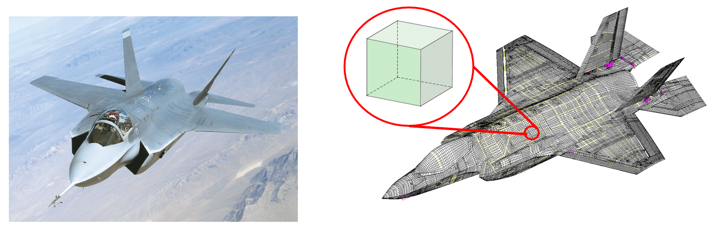

{{1}}
<section>
This module focuses on **linear static FEA**: stress and deformation.

FEA can also represent dynamic events such as impacts, crashes and vibration, but those are beyond the scope of this module.
</section>

{{2}}
<section>
**What type of structures can be analysed?**

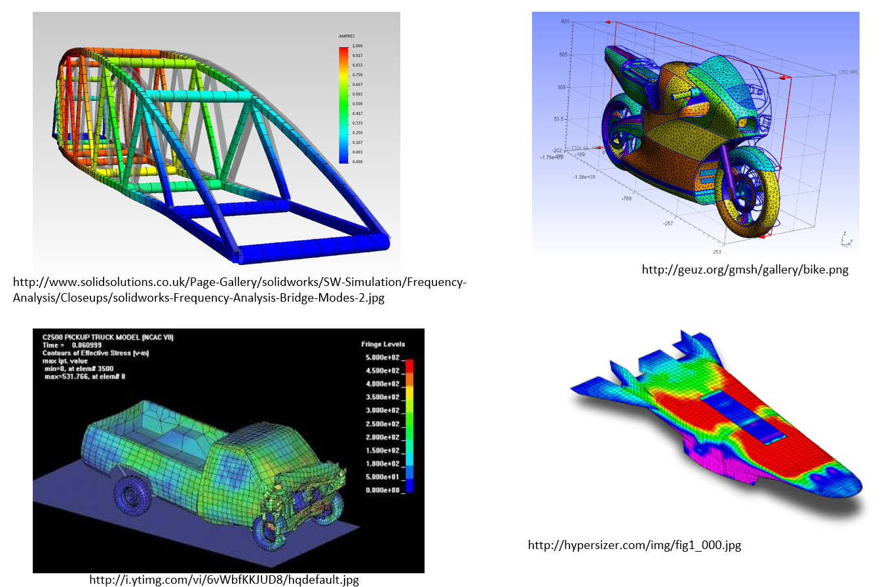
</section>

## What you will cover this semester
<br>
- 1D axial stress and truss elements
- Bending and beam elements
- Torsion
- 2D stress and plane stress elements
- Thin-walled structures and shell elements
- Choosing and combining suitable element types for real structures
<br>
Each topic follows the same broad pattern: understand the mechanics, learn how to model the behaviour, and practise deciding *when* and *how* to apply the model to a real structure.

## Quick check: Units - SI units and prefixes

**Base SI units**

<!--
data-hint-button="2"
data-solution-button="3"
-->
| Mass | Time | Distance |
|:----:|:----:|:--------:|
| [[kg]] | [[s]] | [[m]] |
[[?]] Curiously, g is not the SI unit of mass.

<br>

**Prefixes**

Write 10^n for each prefix in base 10.

<!--
data-solution-button="3"
data-type="none"
-->
| Prefix | Symbol | Base 10 | Decimal | English word |
|:------|:------:|:-------:|:-------:|:------------:|
| Giga  | G | [[10^9]] | 1,000,000,000 | billion |
| Mega  | M | [[10^6]] | 1,000,000 | million |
| Kilo  | k | [[10^3]] | 1,000 | thousand |
| — | — | $10^0$ | 1 | one |
| centi | c | $10^{-2}$ | 0.01 | hundredth |
| [[milli]] | m | $10^{-3}$ | 0.001 | thousandth |
| [[micro]] | μ | $10^{-6}$ | 0.000001 | millionth |
| [[nano]] | n | $10^{-9}$ | 0.000000001 | billionth |

**Note:** centi is typically not used in engineering.

Tonnes, litres and degrees are common non-SI units that are acceptable to use with SI units.

## Quick check: Units - Consistent units

Some FE software, including ABAQUS, does not prescribe a unit system.  
You choose the base units, but they must be **consistent** throughout the model.

Complete the missing entries.

<!--
data-solution-button="3"
data-type="none"
-->
| Mass | Time | Length | Force (derived) | Force (special) | Stress (derived) | Stress (special) |
|:----:|:----:|:------:|:---------------:|:---------------:|:----------------:|:----------------:|
| kg    | s | m   | kg·m·s⁻²       | N      | $\frac{\text{N}}{\text{m}²}$       | Pa  |
| kg    | s | mm  | kg·mm·s⁻²      | [[mN]] | $\frac{\text{mN}}{\text{mm}²}$     | [[kPa]] |
| tonne | s | mm  | tonne·mm·s⁻²   | [[N]]  | $\frac{\text{N}}{\text{mm}²}$     | [[MPa]] |
| ktonne | s | mm  | ktonne·mm·s⁻²   | [[kN]] | $\frac{\text{kN}}{\text{mm}²}$     | [[GPa]] |

In Mechanical/Automotive/Aerospace Engineering, mm is the most common length scale of typical structures. Stresses and material properties are usually given in MPa or GPa.


## B. IN CLASS: Review of 1D stress and ABAQUS

---

**SUPPORTED PRACTICE STARTS HERE**

<br>
There are two tasks to complete:

<br>

1. **Analytical**: Predict the axial bar's response to a given force. Complete the SI Units and Consistent Units tables.

<br>

2. **Numerical (FEA)**: Follow the ABAQUS tutorial to run an input file and view the results.

## Task 1: Predict the response of an axial bar

**IN CLASS · Individual calculation**

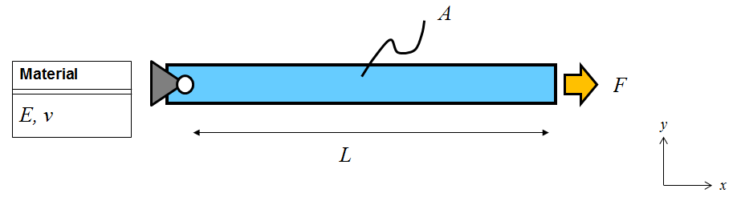

Take $E=200$ GPa, $L=1000$ mm, $A=10$ mm² and $F=5$ kN.

Calculate:

**Axial stress, $\sigma$ (MPa):**

<!--
data-hint-button="2"
data-solution-button="3"
-->
[[500]]
[[?]] Start from $\sigma = F/A$. Convert 5 kN to N; N/mm² is MPa.
************************
$$
\sigma = \frac{F}{A}
= \frac{5000}{10}
= 500\ \text{MPa}
$$
************************

**Axial strain, $\varepsilon$:**

<!--
data-hint-button="2"
data-solution-button="3"
-->
[[0.0025]]
[[?]] Use $\varepsilon = \sigma/E$. Make sure $\sigma$ and $E$ use compatible units.
************************
$$
\varepsilon = \frac{\sigma}{E}
= \frac{500}{200000}
= 0.0025
$$
************************

**Free-end displacement, $\delta$ (mm):**

<!--
data-hint-button="2"
data-solution-button="3"
-->
[[2.5]]
[[?]] Use $\delta = FL/(AE)$, or equivalently $\delta = \varepsilon L$.
************************
$$
\delta = \varepsilon L
= 0.0025\ \text{x}\ 1000
= 2.5\ \text{mm}
$$
************************

Then discuss: **What assumptions allow us to use a linear elastic axial-bar model?**

<br>

<details>
<summary><strong>Reveal answer</strong></summary>

The linear elastic axial-bar model assumes:

- the load is purely axial and acts through the centroid;
- the bar is straight and prismatic;
- stress is uniform across the cross-section away from local end effects;
- the material is homogeneous and isotropic;
- the material remains linear elastic;
- strains and displacements are small;
- bending, instability and dynamic effects are neglected.

</details>

{{1}}
*****************
**Quick check: predict the effect**

$$\delta=\frac{FL}{EA}$$

If $E$ doubles while $F$, $A$ and $L$ stay fixed, what happens to $\delta$?

<!-- data-solution-button="3" -->
[( )] It doubles.
[(X)] It halves.
[( )] It stays the same.
*****************

## Task 2: ABAQUS

**IN CLASS · Complete the following ABAQUS tutorials**

This module will utilise ABAQUS finite element analysis software to solve and analyse a range of structural problems. You will learn how to use ABAQUS and solve a range of problems through the study of guided online tutorial sessions that can be completed in your own time, at your own pace. To test your understanding of each topic, you will complete a short problem and submit through the eLP. This will provide immediate feedback to you.

For today's class, we want you to be able to open and run a simple ABAQUS model using an input file. Complete the following four ABAQUS tutorials:

<br>

1. @[course(Introduction to ABAQUS and input files)](../abaqus/General/IntroToABAQUS/IntroToABAQUS.md)
2. @[course(Opening ABAQUS and setting the work directory)](../abaqus/General/OpeningABAQUS/OpeningABAQUS.md)
3. @[course(Creating and running a job)](../abaqus/General/CreatingRunningJob/CreatingRunningJob.md)
4. @[course(Viewing and interpreting results)](../abaqus/General/ViewingInterpretingResults/ViewingInterpretingResults.md)

<br>

Each tutorial includes instructions and screenshots. Pause to perform each step yourself. Record any message or step where you need help.

<br>

{{1}}
*****************
**ABAQUS: does the answer make sense?**

<details>
<summary>Compare your output with the analytical prediction. Do the values match?</summary>

<!-- 
  data-sortable="false"
  data-type="none"
-->
| Value | FEA Result | |
| --- | --- | --- |
| Node 100 displacement U1 | [[0]] mm | This is the fixed end |
| Node 200 displacement U1 | [[2.5]] mm | The bar extends in the load direction |
| Node 100 reaction RF1 | [[-5000]] N | Reaction balances the applied load |
| Element axial stress S11 | [[500]] MPa | Tension, equal to force divided by area |

</details>

Why is there only one element? For this uniform bar under an end load, displacement varies linearly and axial stress is constant. One linear truss element can reproduce this idealised response. This does not establish that one element is sufficient for other structures.

*****************
{{2}}
*****************

**Before you leave the PC**

Show a member of staff:

- the completed job and where the output file is stored;
- your measured U1 and its units;
- comparison with your hand calculation.

Keep your own notes and save your files to your usual student storage after the analysis finishes.

*****************

## C. INDEPENDENT STUDY: Before Week 2

---

**NEXT SESSION PREPARATION**

- Study the online material for @[course(**Week 2: Axial Stress and Truss Elements**)](../week02/week02.md), including the theory videos and ABAQUS tutorials.
- Complete the Week 2 quiz before the session, following the published Blackboard deadline.
- Bring your working, tutorial notes and questions.

You will begin the first analytical and ABAQUS topic problems during the session.

## Week 1 completion check

**INDEPENDENT STUDY · Ready to move on?**

- [ ] I can explain the weekly preparation and class-work pattern.
- [ ] I can identify elastic and plastic behaviour on a stress–strain curve and can choose consistent units.
- [ ] I can calculate stress, strain and displacement for a simple 1D bar problem.
- [ ] I have run the supplied input file and verified the results against the hand-calc.
- [ ] I know which Week 2 material to study and where to find the quiz deadline.

If a box remains unticked, ask for help before you leave the session.
