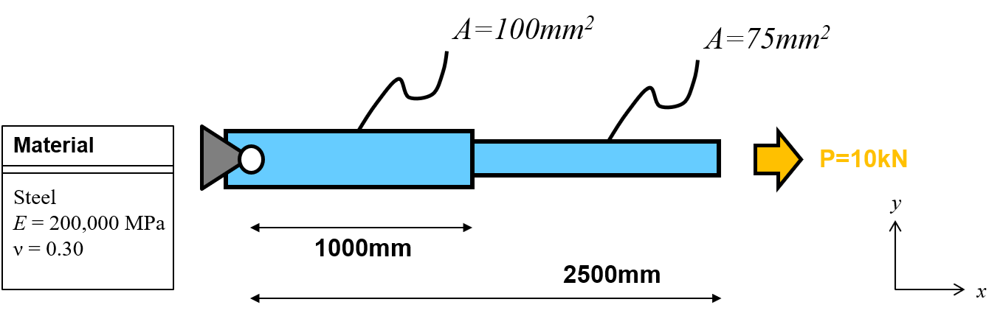
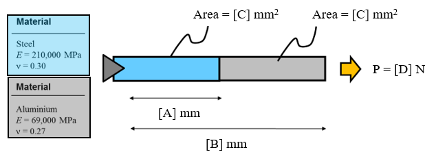

<!--
author:   Matthew Blacklock
email:    matthew.blacklock@northumbria.ac.uk
version:  1.0.0
mode:     Presentation
import:   https://raw.githubusercontent.com/MINT-the-GAP/lia-board-mode/main/README.md
          https://raw.githubusercontent.com/MINT-the-GAP/lia-annotation/main/README.md
          ../common/templates.md
comment:  KB5034 Week 2 - axial stress and truss elements.

-->

# Week 2: Axial stress and truss elements

@moduleTitle

---

@[course(Return to Week 1)](../week01/week01.md)

---

## Topic Learning Outcomes

By the end of this week, students will be able to:

 

**1.1.** Define the number of nodes, degrees of freedom and the size of the stiffness matrix for 1D and 2D truss elements.

 

**1.2.** Model a 1D truss structure using the finite element method and compare your results against hand calculations.

 

**1.3.** Solve for a simple 1D truss structure using the assembly of stiffness matrices.

## A. INDEPENDENT STUDY: Before class

**PREPARATION STARTS HERE**

There are videos and ABAQUS tutorials to complete this week before class. Watch the recordings and complete the tutorials in order. 

Complete the quick checks before moving on.

## Video 1: Introduction to Truss Elements

@Panopto(a0fd3f92-d3fd-4d95-8b4a-b4da00d9e2b3)

{{1}}
********************
**Quick check**

In the ideal truss model used here, which internal action does an element carry?

<!-- data-solution-button="3" -->
[(X)] Axial tension or compression.
[( )] Bending moment only.
[( )] Torsion only.

An ideal truss element connects nodes and resists extension or shortening along its axis.
********************

## Video 2: Nodes, degrees of freedom and matrix size

**Learning Outcome 1.1. Define the number of nodes, degrees of freedom and the size of the stiffness matrix for 1D and 2D truss elements.**

 
You are encouraged to take your own notes. However, partially filled out notes can be found [here](files/Week%202%20Online%20Video.pdf). You can fill in the blanks while watching the video(s).

@Panopto(7bd32a55-22fe-404f-b713-b4da00d9e26f)

{{1}}
********************
**Quick check**

After watching, complete the table. Enter matrix sizes as `2x2`, `3x3` etc.

<!--
data-solution-button="3"
data-type="none"
-->
| Element | Nodes | Translational DOFs per node | Element stiffness matrix |
|:---|:---:|:---:|:---:|
| 1D truss | [[2]] | [[1]], along the bar | [[2x2]] |
| 2D truss | [[2]] | [[2]], in $x$ and $y$ | [[4x4]] |
********************

{{2}}
********************
**Quick check**

Two 1D truss elements meet at one shared node. Before boundary conditions, how many nodal displacement DOFs and what size global stiffness matrix are needed?

<!-- data-solution-button="3" -->
[( )] 4 DOFs and a 4 × 4 matrix.
[(X)] 3 DOFs and a 3 × 3 matrix.
[( )] 2 DOFs and a 2 × 2 matrix.

The connected model has three distinct nodes. Each has one axial displacement DOF.
********************

## ABAQUS: 1D Truss Elements

Work through these tutorials in order.

1. @[course(Introduction to ABAQUS input files)](../abaqus/Topic1/IntroToInputFiles/IntroToInputFiles.md)
2. @[course(Multiple 1D truss elements with different section properties)](../abaqus/Topic1/MultipleTrussElements/MultipleTrussElements.md)

## Before class completion check

 

- [ ] **Quiz** - Complete the Blackboard Test for 1D Truss Elements in the Week 2 folder on the eLP. This counts towards your assessment.
- [ ] **Bring to class:** your notes, input files, and any questions from the videos or tutorials.

## B. IN CLASS: Axial stress and truss elements

---

**SUPPORTED CLASS STUDY STARTS HERE**

## Recap: nodes, DOFs and matrix size

**Q1. How many degrees of freedom are there in total for a 2D truss element?**

<!-- data-solution-button="3" -->
[( )] 2
[(X)] 4
[( )] 6
[( )] 8

[[?]] Think about the number of nodes and the translational DOFs at each node.

{{1}}
********************

**Q2. If mm, tonne and s are selected as the base units, what units of force and stress should be used?**

<!-- data-solution-button="3" -->
[( )] kN and MPa
[(X)] N and MPa
[( )] N and Pa
[( )] kN and GPa

[[?]] Derive force from mass × acceleration, then consider force per unit area.
********************

{{2}}
********************

**Q3. A 3D element has 8 nodes and 3 DOFs at each node. What is the size of the stiffness matrix?**

<!-- data-solution-button="3" -->
[( )] 8 × 8
[( )] 16 × 16
[(X)] 24 × 24
[( )] 48 × 48

[[?]] First determine the total number of DOFs in the element.

********************

{{3}}
********************
**Q4. Two 1D elements meet at a shared node. Why does the model have three displacement DOFs rather than four?**

<!-- data-solution-button="3" -->
[( )] Applying a support removes one of the element nodes.
[(X)] The connected elements share the displacement at their common node.
[( )] Each element contributes only one displacement DOF.
********************

## One 1D truss element derivation: axial mechanics

Take $E=200$ GPa, $L=1000$ mm, $A=10$ mm² and $F=5$ kN.

  

{{1}}
********************

<strong>Reveal the single-element derivation</strong>

The finite element representation of this problem is a single two-noded 1D truss element

<svg viewBox="0 0 700 180"
     width="80%"
     style="display:block; margin:auto;"
     xmlns="http://www.w3.org/2000/svg">

  <defs>
    <marker id="arrow" markerWidth="10" markerHeight="10" refX="8" refY="3" orient="auto">
      <path d="M0,0 L0,6 L9,3 z" fill="#333"/>
    </marker>
  </defs>

  <!-- element -->
  <line x1="130" y1="70" x2="570" y2="70"
        stroke="#333" stroke-width="6" stroke-linecap="round"/>

  <!-- nodes -->
  <circle cx="130" cy="70" r="12" fill="#333"/>
  <circle cx="570" cy="70" r="12" fill="#333"/>

  <!-- node numbers -->
  <text x="118" y="45" font-family="Arial, Helvetica, sans-serif" font-size="24">1</text>
  <text x="558" y="45" font-family="Arial, Helvetica, sans-serif" font-size="24">2</text>

  <!-- displacement / force arrows at node 1 -->
  <line x1="120" y1="120" x2="180" y2="120"
        stroke="#333" stroke-width="3" marker-end="url(#arrow)"/>
  <text x="120" y="150"
        font-family="Arial, Helvetica, sans-serif"
        font-size="24"
        font-style="italic">u₁, f₁</text>

  <!-- displacement / force arrows at node 2 -->
  <line x1="570" y1="120" x2="635" y2="120"
        stroke="#333" stroke-width="3" marker-end="url(#arrow)"/>
  <text x="570" y="150"
        font-family="Arial, Helvetica, sans-serif"
        font-size="24"
        font-style="italic">u₂, f₂</text>
</svg>

For a straight element of length $L$, area $A$ and Young's modulus $E$, begin with the axial mechanics relationships:

$$
\sigma=\frac{F}{A},
\qquad
\varepsilon=\frac{\Delta L}{L},
\qquad
\sigma=E\varepsilon.
$$

Combining these equations gives

$$
\frac{F}{A}=E\frac{\Delta L}{L}.
$$

Rearranging,

$$
F=\frac{EA}{L}\Delta L.
$$

For a two-node truss element,

$$
\Delta L=u_2-u_1.
$$

Taking the positive axial direction from node 1 to node 2, the force at node 2 is

$$
f_2=\frac{EA}{L}(u_2-u_1).
$$

Equilibrium requires

$$
f_1+f_2=0,
$$

so

$$
f_1=-f_2.
$$

Therefore,

$$
f_1=\frac{EA}{L}(u_1-u_2).
$$

Writing both nodal force equations explicitly,

$$
f_1=\frac{EA}{L}u_1-\frac{EA}{L}u_2,
$$

$$
f_2=-\frac{EA}{L}u_1+\frac{EA}{L}u_2.
$$

These can now be written in matrix form:

$$
\begin{bmatrix}
f_1\\
f_2
\end{bmatrix}
=
\begin{bmatrix}
\frac{EA}{L} & -\frac{EA}{L}\\[8pt]
-\frac{EA}{L} & \frac{EA}{L}
\end{bmatrix}
\begin{bmatrix}
u_1\\
u_2
\end{bmatrix}.
$$

Factoring out $\frac{EA}{L}$ gives

$$
\begin{bmatrix}
f_1\\
f_2
\end{bmatrix}
=
\frac{EA}{L}
\begin{bmatrix}
1 & -1\\
-1 & 1
\end{bmatrix}
\begin{bmatrix}
u_1\\
u_2
\end{bmatrix}.
$$

The quantity

$$
k=\frac{EA}{L}
$$

is the axial stiffness of the element.

So the element stiffness equation may also be written as

$$
\begin{bmatrix}
f_1\\
f_2
\end{bmatrix}
=
k
\begin{bmatrix}
1 & -1\\
-1 & 1
\end{bmatrix}
\begin{bmatrix}
u_1\\
u_2
\end{bmatrix}.
$$

**Applying loads and boundary conditions to solve**

For the bar shown, node 1 is fixed, so

$$
u_1=0.
$$

A force $F$ is applied at node 2, so

$$
f_2=F.
$$

The stiffness equation becomes:

$$
\begin{bmatrix}
f_1\\
F
\end{bmatrix}
=
\frac{EA}{L}
\begin{bmatrix}
1 & -1\\
-1 & 1
\end{bmatrix}
\begin{bmatrix}
0\\
u_2
\end{bmatrix}.
$$

The first row contains the unknown reaction force at the restrained degree of freedom. We can set this row aside while solving for the unknown displacement, then return to it later to calculate the reaction.

Using the second row,

$$
F
=
\frac{EA}{L}
\left(
-0+u_2
\right).
$$

which simplifies to

$$
F
=
\frac{EA}{L}u_2.
$$

Therefore,

$$
u_2
=
\frac{FL}{EA}.
$$

This is the familiar axial displacement equation, recovered directly from the finite element stiffness relation.

********************

## What controls axial stiffness?

For a 1D truss element,

$$k=\frac{EA}{L}.$$

If all other quantities remain fixed, what happens to $k$?

<!--
data-solution-button="3"
data-type="none"
-->
| Change | Effect on $k$ |
|:---|:---:|
| Double $E$ | [[(doubles)|halves|stays the same]] |
| Double $A$ | [[(doubles)|halves|stays the same]] |
| Double $L$ | [[(halves)|doubles|stays the same]] |

  {{1}}
***************

**Q: What makes an axial element stiffer?**

<!--
data-solution-button="3"
data-type="none"
-->
[( )] lower $E$, smaller $A$, shorter $L$
[( )] higher $E$, smaller $A$, shorter $L$
[(X)] higher $E$, larger $A$, shorter $L$
[( )] higher $E$, larger $A$, longer $L$

***************

## Two 1D truss elements: assembly

  

{{1}}
********************

**Step 1**: Derive the individual element stiffness matrices and assemble the global matrix

<strong>Reveal the symbolic two-element derivation</strong>

Since the problem is made up of two geometrically different bars, the finite element representation of this problem comprises two 1D truss elements with a shared connecting node

<svg viewBox="0 0 900 220"
     width="85%"
     style="display:block; margin:auto;"
     xmlns="http://www.w3.org/2000/svg">

  <defs>
    <marker id="arrow" markerWidth="10" markerHeight="10" refX="8" refY="3" orient="auto">
      <path d="M0,0 L0,6 L9,3 z" fill="#333"/>
    </marker>
  </defs>

  <!-- elements -->
  <line x1="140" y1="80" x2="430" y2="80"
        stroke="#333" stroke-width="6" stroke-linecap="round"/>
  <line x1="430" y1="80" x2="720" y2="80"
        stroke="#333" stroke-width="6" stroke-linecap="round"/>

  <!-- nodes -->
  <circle cx="140" cy="80" r="12" fill="#333"/>
  <circle cx="430" cy="80" r="12" fill="#333"/>
  <circle cx="720" cy="80" r="12" fill="#333"/>

  <!-- node numbers -->
  <text x="128" y="52"
        font-family="Arial, Helvetica, sans-serif"
        font-size="24">1</text>
  <text x="418" y="52"
        font-family="Arial, Helvetica, sans-serif"
        font-size="24">2</text>
  <text x="708" y="52"
        font-family="Arial, Helvetica, sans-serif"
        font-size="24">3</text>

  <!-- element labels -->
  <text x="285" y="45"
        text-anchor="middle"
        font-family="Arial, Helvetica, sans-serif"
        font-size="24"
        font-style="italic">k₁</text>

  <text x="575" y="45"
        text-anchor="middle"
        font-family="Arial, Helvetica, sans-serif"
        font-size="24"
        font-style="italic">k₂</text>

  <!-- displacement / force arrows -->
  <line x1="130" y1="140" x2="190" y2="140"
        stroke="#333" stroke-width="3" marker-end="url(#arrow)"/>
  <text x="125" y="175"
        font-family="Arial, Helvetica, sans-serif"
        font-size="24"
        font-style="italic">u₁, f₁</text>

  <line x1="420" y1="140" x2="480" y2="140"
        stroke="#333" stroke-width="3" marker-end="url(#arrow)"/>
  <text x="415" y="175"
        font-family="Arial, Helvetica, sans-serif"
        font-size="24"
        font-style="italic">u₂, f₂</text>

  <line x1="710" y1="140" x2="770" y2="140"
        stroke="#333" stroke-width="3" marker-end="url(#arrow)"/>
  <text x="705" y="175"
        font-family="Arial, Helvetica, sans-serif"
        font-size="24"
        font-style="italic">u₃, f₃</text>
</svg>

Element 1 connects nodes 1 and 2:

$$
\begin{bmatrix}
f_1^{(1)}\\
f_2^{(1)}
\end{bmatrix}
=
k_1
\begin{bmatrix}
1&-1\\
-1&1
\end{bmatrix}
\begin{bmatrix}
u_1\\
u_2
\end{bmatrix}.
$$

Element 2 connects nodes 2 and 3:

$$
\begin{bmatrix}
f_2^{(2)}\\
f_3^{(2)}
\end{bmatrix}
=
k_2
\begin{bmatrix}
1&-1\\
-1&1
\end{bmatrix}
\begin{bmatrix}
u_2\\
u_3
\end{bmatrix}.
$$

At the shared node, the force contributions from the connected elements sum:

$$
f_1=f_1^{(1)},
$$

$$
f_2=f_2^{(1)}+f_2^{(2)},
$$

$$
f_3=f_3^{(2)}.
$$

From element 1,

$$
f_1^{(1)}=k_1(u_1-u_2),
$$

$$
f_2^{(1)}=k_1(u_2-u_1).
$$

From element 2,

$$
f_2^{(2)}=k_2(u_2-u_3),
$$

$$
f_3^{(2)}=k_2(u_3-u_2).
$$

Substituting the two element contributions at the shared node gives

$$
f_2=
k_1(u_2-u_1)
+
k_2(u_2-u_3),
$$

which simplifies to

$$
f_2=-k_1u_1+(k_1+k_2)u_2-k_2u_3.
$$

Element 1 connects global nodes 1 and 2, so its stiffness matrix contributes to rows and columns 1 and 2:

$$
\mathbf K^{(1)}=
\begin{bmatrix}
k_1 & -k_1 & 0\\
-k_1 & k_1 & 0\\
0 & 0 & 0
\end{bmatrix}.
$$

Element 2 connects global nodes 2 and 3, so its stiffness matrix contributes to rows and columns 2 and 3:

$$
\mathbf K^{(2)}=
\begin{bmatrix}
0 & 0 & 0\\
0 & k_2 & -k_2\\
0 & -k_2 & k_2
\end{bmatrix}.
$$

The global stiffness matrix is found by adding the two element contributions:

$$
\mathbf K
=
\mathbf K^{(1)}+\mathbf K^{(2)}.
$$

Therefore,

$$
\begin{bmatrix}
k_1 & -k_1 & 0\\
-k_1 & k_1 & 0\\
0 & 0 & 0
\end{bmatrix}
+
\begin{bmatrix}
0 & 0 & 0\\
0 & k_2 & -k_2\\
0 & -k_2 & k_2
\end{bmatrix}
=
\begin{bmatrix}
k_1 & -k_1 & 0\\
-k_1 & k_1+k_2 & -k_2\\
0 & -k_2 & k_2
\end{bmatrix}.
$$

The assembled global stiffness equation is therefore

$$
\begin{bmatrix}
f_1\\
f_2\\
f_3
\end{bmatrix}
=
\begin{bmatrix}
k_1&-k_1&0\\
-k_1&k_1+k_2&-k_2\\
0&-k_2&k_2
\end{bmatrix}
\begin{bmatrix}
u_1\\
u_2\\
u_3
\end{bmatrix}.
$$

********************

{{2}}
********************

**Quick check: Why does the middle diagonal term become $k_1+k_2$?**

<!-- data-solution-button="2" -->
[( )] Because node 2 is fixed.
[(X)] Because both elements contribute stiffness at the shared node.
[( )] Because the two element lengths are added.
[( )] Because there are three displacement DOFs.

********************

{{3}}
********************
 
**Step 2: Student problem - Apply loads and boundary conditions**

Starting from the assembled symbolic stiffness equation:

1. Apply the nodal loads.
2. Apply the displacement boundary condition.
3. Identify the row associated with the reaction force.
4. Reduce the system of equations.
5. Calculate and substitute the two element stiffness values, $k_1$ and $k_2$.
6. Solve for the unknown nodal displacements.

Note: You can substitute in values for E, A and L for each element at the start, but it is neater and quicker to keep the system symbolic until Step 5.

Keep your working so that you can compare the hand calculation with your ABAQUS model.

 

**Before you start: What are the boundary conditions?**

<!-- data-solution-button="2" -->
[( )] $u_1 = u_2 = u_3 = 0$
[( )] $u_1$ is unknown, $u_2 = u_3 = 0$
[(X)] $u_1 = 0$, $u_2$ and $u_3$ are unknown

**What are the nodal forces?**

<!-- data-solution-button="2" -->
[( )] $f_1 = f_2 = 0$, $f_3 = 10$ kN
[(X)] $f_1$ is an unknown reaction, $f_2 = 0$, $f_3 = 10$ kN
[( )] $f_1$ and $f_2$ are unknown reactions, $f_3 = 10$ kN

********************

{{4}}
********************
**Answer check**

Once you have completed the hand calculation, check your nodal displacements:

<!-- data-solution-button="2" -->
**Node 2** displacement, $u_2$ = [[0.5]] mm.  
**Node 3** displacement, $u_3$ = [[1.5]] mm.
********************

## ABAQUS problem

Open **ABAQUS problem: 1D Truss Elements** in the Week 2 folder on the eLP.

Edit your input file from the Week 2 ABAQUS tutorials to solve the problem above.

Before editing the input file, identify:

- the required nodes and their coordinates
- which nodes each element connects
- the material and section properties for each element
- the boundary conditions and applied load
- the output quantity requested by the problem

Use the hand-calculation process as a model check.

Before leaving, show a member of staff your model setup or the progress recorded in your input file. Note any problem that you still need to resolve.

## Week 2 completion check

 

**1.1. Define the number of nodes, degrees of freedom and the size of the stiffness matrix for 1D and 2D truss elements.**

- [ ] I can count the nodes and displacement DOFs in 1D and 2D truss models.
- [ ] I can determine the stiffness-matrix size from the total number of DOFs.

**1.2. Model a 1D truss structure using the finite element method and compare your results against hand calculations.**

- [ ] I can explain the physical meaning of $EA/L$.
- [ ] I can derive the 1D truss element equation from axial mechanics.
- [ ] I have started the released ABAQUS problem and saved my own input file.
- [ ] I can compare the ABAQUS displacement and reaction results with my hand calculation.

**1.3. Solve a simple 1D truss structure using the assembly of stiffness matrices.**

- [ ] I can explain why element contributions add at a shared node.
- [ ] I can assemble the global stiffness matrix for a two-element 1D truss.
- [ ] I can apply loads and displacement boundary conditions to the assembled system.
- [ ] I can identify the reaction-force row and reduce the system.
- [ ] I can solve for the unknown nodal displacements.

## C. INDEPENDENT STUDY: After class

Finish the 1D ABAQUS problem using your own input file and submit your individual answer by **23:59 on the Wednesday following the session**.

Keep the input file. You will also submit the input files for all ABAQUS problems by **23:59 on Thursday 17 December 2026**.

Complete the Week 3 pre-work on 2D truss elements and bring your notes and questions to the next session.

## Further reading

@FurtherReading(2,Direct stiffness method,3,Truss equations)